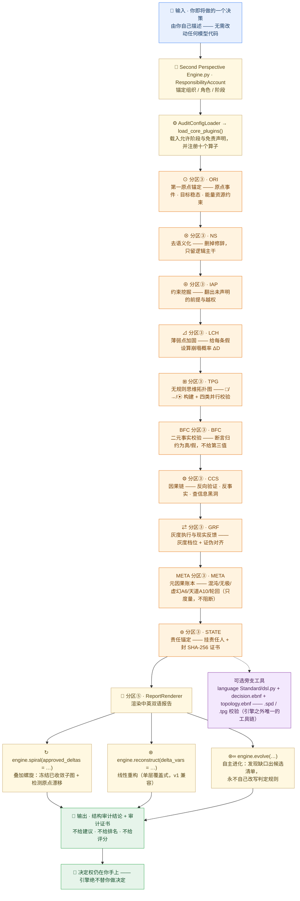

<p align="center">
  
  
  
  
</p>

<blockquote align="center">
  <em>全局认知审计引擎（GCAE）· 第二视角引擎 1.0 · 第二视角语言</em>
</blockquote>

<p align="center">
  <a href="README.md">English</a> | 简体中文
</p>

<div style="max-width:880px;margin:0 auto;padding:0 16px">

## ✦ 关于

<p style="font-size:15px;line-height:1.8;color:#2C2C2C">
<strong>全局认知审计引擎（GCAE）</strong>是全球首个中立的、核心离线的、与决策无关的认知偏差审计引擎。它为 AI 系统与企业决策提供独立的第三方安全与合规审计，且无需修改内部模型代码。
</p>

<p style="font-size:15px;line-height:1.8;color:#2C2C2C">
<strong>核心使命</strong> —— 一切不确定性、一切灾难、一切苦难，最终都源于我们对因果链的无知。该引擎通过系统性地识别隐含假设、客观不确定性与人类认知偏差，为高风险理性决策提供中立、可追溯的结构性支撑。
</p>

<p style="font-size:15px;line-height:1.8;color:#2C2C2C">
✅ <strong>已通过 IMDA AI Verify 评估，总分 95</strong> —— 完整报告见 <code>IMDA_AI_Verify_Causal_Audit_Report.pdf</code>。
</p>

</div>

## ✦ 引用

方法以公开技术报告（Version 1.0，2026）为准，引用格式：

> Ji, Zhichen. *Structural Auditing of Decision Claims: A Deterministic Offline Method and Its Reproducible Evidence Chain.* Zenodo, 2026. DOI: [10.5281/zenodo.23244508](https://doi.org/10.5281/zenodo.23244508)

存缴包——报告、Markdown 源、验证日志与完整源码快照——镜像于 [`docs/zenodo/deposit/`](./docs/zenodo/deposit/)。

<p align="center">— ✦ —</p>

## ✦ 系统架构

> **一句话：** GCAE 是一台**中立的决策体检机**——你描述一个决策，一串写明了名字的模块把它逐步拆开，最后交给你一份结构结论。它从不替你做决定。



**这张图怎么看**

1. **从上往下读，就是一次完整的审计。** 进去的是你自己写的决策描述，出来的只有结构结论 + 审计证书。
2. **每一步都写了干这件事的算子**（分区③ 从 `ORI` 到 `STATE`），可以对着图翻源码。十个算子的顺序由 `PIPELINE_ORDER` 唯一定义，不会跳步。`META` 排在 `GRF` 之后、`STATE` 之前：它要读四家结果才能结算五条元基。
3. **三条出口，语义互不干扰。** `spiral()` 逐层叠加并冻结已收敛子图、检测原点漂移；`reconstruct()` 保留 v1 的线性覆盖语义；`evolve()` 只出候选清单、只升代际，**不碰判定规则**。
4. **输出刻意「克制」，旁支也是可选的。** 不给建议、不给排名、不给评分；`.spd` / `.tpg` 校验器在引擎之外，叙述层默认关闭，永远改不了判定。

📖 每个术语都用一句人话解释 → [术语表 GLOSSARY](./GLOSSARY.md)

## ✦ 在线演示

<div style="max-width:880px;margin:0 auto;padding:0 16px">

直接在浏览器中体验完整的五算子因果审计流水线 —— 零安装、零上传、完全确定性：

🌐 **在线演示**：[https://nohnlins.com/audit/](https://nohnlins.com/audit/)

> 完全在客户端运行。你的决策数据永不离开浏览器。

</div>

<p align="center">— ✦ —</p>

## ✦ 十大算子

<div style="max-width:880px;margin:0 auto;padding:0 16px">

十个算子全部内联在引擎的**分区③**中，仓库里没有 `plugins/` 包。前五项沿用 2026.1 标准；
其后四项为 2026.2 拓扑层新增；末位 META 为 **2026.3 元因果层**新增
（**语法扩展 2026.3**，已在 `language Standard/topology.ebnf` 中显式声明）：

| 算子 | 符号 | 引擎内类 | 说明 |
|---|---|---|---|
| 第一原点锚定（ORI） | ⊙ | `OriginAnchorPlugin` | 锚定原点事件 / 目标稳态 / 能量资源约束；原点真空即阻断 |
| 去语义化（NS） | ⊗ | `NarrativeStripPlugin` | 剥离修辞、情绪与模糊量词；提取逻辑内核 |
| 约束挖掘（IAP） | ⊕ | `ImplicitAssumptionPlugin` | 揭示隐藏假设、特权绕过与循环论证 |
| 薄弱点加固（LCH） | ⊿ | `FragilityLatchPlugin` | 计算每个假设的 ΔD 崩塌概率；定位最脆弱的变量 |
| 无规则思维拓扑图（TPG） | ⊞ | `TopologyGraphPlugin` | 构建 □/→/⦿ 无语义拓扑；跑**四类**并行校验 |
| 二元事实校验（BFC） | —（字母编码） | `BinaryFactCheckPlugin` | 断言归约为**真 / 假**；证据真空或互斥即阻断，绝不给第三值 |
| 因果链同步（CCS） | ⚙ | `CausalChainSyncPlugin` | 反向验证 + 反事实校验 + 黑洞检测 |
| 灰度执行与现实反馈（GRF） | ⇄ | `GrayFeedbackPlugin` | 灰度档位 + 现实证伪对齐；证伪却无回退即阻断 |
| 元因果账本（META） | —（字母编码） | `MetaCausalLedgerPlugin` | 混沌 / 无极 / 虚幻 A6 / 天道 A10 / 轮回 五条元基落成账本；**永不阻断** |
| 责任锚定（STATE） | ⊚ | `StateAnchorPlugin` | 责任锚定 + SHA-256 审计证书 |

**META 为什么用字母而不是符号**：它是一本**度量账本**，取 `T2_SIGNAL` 权限层，
结构上不可能翻转任何一次审计的通过与否。给它一个像 ⦿ 那样的符号，会让人误以为
那是又一条公理；而「指标不好看」与「输入不完整」是两件事——中断只留给后者。

**BFC 与 GRF 的分工**（两者都会追问"证伪"，但不是同一件事）：

| 模块 | 问的问题 | 层级 |
|---|---|---|
| ⇄ GRF | 现实反馈回来了，**结构上有没有回退路径 ΔD** | 行为层 |
| BFC | 这条断言，**有没有证据、证据打不打架、核验结果是什么** | 认知层 |

BFC 默认**关闸**：不提供 `facts` 时它原样放行（`status = SKIPPED`），存量审计的判定与链根不变。
它只认两个真值——`binary=None` 只表示「未声明」并必然伴随 `VERDICT_UNDECLARED` 信号，
从不被当作第三个真值参与判定。

### 拓扑层符号（无语义）

符号不携带语义，语义由算子在运算中生成。标签 △/◇ 是**相对**的，不参与任何判定。

| 符号 | 拓扑含义 | 约束 |
|---|---|---|
| `□` | 实体节点 | 无固有属性；删除全部连接边后自动消失 |
| `→` | 因果有向边 | 可带 `weight` / `validity` 参数 |
| `t` | 链内时序（公理 5） | 可选；缺位由**最长路径**派生。声明值须落在 `[t(前置), t(后继)-1]` |
| `⦿` | 全局公理约束 | 不可修改，全局生效 |
| `△` | 上游节点（相对标签） | 对下游表现为可证伪的输入假设 |
| `◇` | 下游节点（相对标签） | 对上游表现为不可篡改的输出决策 |

`t` 不是时间戳，而是「链内第几位」。规范公理 5 把时间定为**构成条件**而非可拆字段：
「没有这一前提，『链』这个概念本身无法成立」。所以：多起点（多线并行）**合法**；
同一对节点被声明两条边（分叉）**违规**；有向环让序无法赋值，链随之不成立。

### 四类并行校验

| 校验 | 规则 | 等级 |
|---|---|---|
| 一致性 `consistency` | 节点身份全局唯一、无自相矛盾的边定义 | **致命**，直接终止推演 |
| 约束满足 `constraint` | 所有边参数符合 ⦿，无越界 | **致命**，直接终止推演 |
| 拓扑闭合 `closure` | 无悬空节点/边、无因果悖论（含自环） | 警告，可强制继续但**结果无效** |
| 链内时序 `time_order` | 无分叉（T305）、序不倒置（T307）、序可赋值（T308） | 警告，可强制继续但**结果无效** |

时序之所以单列而不并入闭合：闭合问「图自洽吗」，时序问「这张图**还成不成立为一条链**」。
两者可以各自独立失败，合并就会丢掉一个真问题。

### 元因果账本（混沌 · 无极 · 虚幻 · 天道 · 轮回）

规范第六条的**元因果基底**在此落成五个可计算的账本。它们只度量、不裁决：

| 元基 | 落地为 | 判据 |
|---|---|---|
| 混沌 | 缺口账本 `chaos_gaps` | 「随机」不在混沌之中，**只在观测者的知识缺口之中**。把未解析的前置因说成「看运气」→ 高风险 |
| 无极 | 多线并行 `parallel_chains` | 平行（多起点）合法；分叉（同一对节点多边）违规。极限处唯一收敛 S∞ = S* |
| 虚幻 | **A6 叙事熵** | 遮蔽字符 / 总字符 —— 有理数，非概率。同时记录现实面（⇄GRF），一体两面缺一不可 |
| 天道 | **A10 审计熵增** | 每层留痕条数（version 增速的离散版）；**有界**才使演化收敛于 S* |
| 轮回 | 承接完整性 | 不是链的自环，而是链的普遍承接：果即刻成因，序不可倒置 |

### 编排层：线性重构 vs 叠加螺旋 vs 自主进化

| 入口 | 语义 | 停机判据 |
|---|---|---|
| `engine.reconstruct()` | ⊛ 线性重构：每层 `ctx.update()` 覆盖上一层 | 相邻两轮风险集合相同（不动点） |
| `engine.spiral()` | ↻ 叠加螺旋：冻结已收敛子图 + 原点漂移检测 + 能量预算硬顶 | 不动点 **且** 原点未漂移 |
| `engine.limit_reconstruct()` | ∞ 极限收敛：层数不设上限 | 距离连续归零并保持 → 抵达 S∞ = S* |
| `engine.evolve()` | ⊛∞ 自主进化：**发现**结构缺口，产出候选清单 | 最小不动点 `g_{n+1} == g_n`（图同构） |

**`evolve()` 为什么不去改自己**：引擎一旦能改自己的判定规则，第三方就再也无法
「拿同一份代码复算出同一个根」，产出的证书只是一张自签名的纸。所以三条恒等式写死在返回值里：
`applies_automatically = False` · `requires_human = True` · `auto_applied = 0`。
人工裁决走 `approve_evolution_proposal()`，它**只记账（升代际）**，
返回里明写 `applied_to_code = False` —— 改代码必须由人来做。

</div>

<p align="center">— ✦ —</p>

## ✦ 能力边界（拦什么 · 不拦什么）

<div style="max-width:880px;margin:0 auto;padding:0 16px">

本引擎**不给保证，只做结构核验**。所以边界必须写死——把"不拦的"写成"能拦的"，交付时必然翻车。

### 一、拦得住（有硬机制，不是话术）

| 机制 | 拦住的 | 级别 |
|---|---|---|
| **LLM 永不裁决** | 模型输出里出现 `status` / `converged` / `verdict` / `weight` / `rank` 一律被**剥离并留痕**；任何 LLM 输出都不能翻转假设状态或方案排序 | 结构性 |
| **I-1 非猜测** | 缺失的事实 / 权重 / 阈值 / 责任人**不估算**，直接中断并逐条列出补齐条件 | `BLOCKED` |
| ⊕ IAP 约束挖掘 | 未声明的前提、特权绕过、循环论证 | 信号 |
| BFC 二元事实校验 | 证据真空 · 证据互斥 · 已证伪前提仍在使用 | `BLOCKED` |
| ⇄ GRF 现实反馈 | 现实已证伪却**没有回退路径 ΔD**；无灰度阶梯 | `BLOCKED` / 告警 |
| ⊞ TPG 拓扑校验 | 身份冲突、参数越界（致命）；悬空节点/边、因果悖论（结果无效） | 致命 / 警告 |
| 链内时序（公理 5） | 序倒置；同一对节点多边（分叉）；有环致序不可赋值 | 警告，结果无效 |
| ⊚ STATE 责任锚定 | 缺责任人、责任主体模糊 | `BLOCKED` |
| **可复现证书** | 同输入 + 同 nonce + 同 clock → **同链根**，跨机可复算，不依赖任何模型厂商 | 可核验 |

### 二、拦不住（明确不承诺）

| 不承诺 | 为什么 |
|---|---|
| **不检测"偏见"** | 没有统计公平性检验、没有群体差异度量、没有训练数据审计。它拦的是偏见在**结构上的表现**：未声明的前提、不可证伪的假设 |
| **不让模型不出错** | 它不判断模型想得对不对，只检查「**有没有把没证据的东西当成证据用**」 |
| **不做专业判断** | 不读病历、不审内容、不解释模型；不做医学 / 法律 / 金融 / 安全专业结论 |
| **不管运行时安全** | 与飞控、调度指令、工具链、网络防护无关 |
| **不让无解变有解** | 不提供新知识、不突破信息缺失、不替你做价值取舍。它把"无解"**精确化**为「卡在哪一条、缺什么」 |
| **不替你做决定** | `AWAITING_HUMAN` 是常态；引擎**永不自己生成修正**——一旦自己补缺，就是把"无解"洗成"有解"，**那正是幻觉的产生方式** |

### 三、引用纪律

> ❌ **不要说**：本引擎能检测 AI 偏见 · 保证内容安全 · 让 AI 不出错 · 解决无解难题
>
> ✅ **应该说**：把不可验证的部分挡在决策结构之外 · 让结论不经过结构核验就落不了地 · 把「不知道哪里卡住」推进到「知道卡在哪一条上」

**对外定位语**：`第二视角引擎（结构核验 · 不保证模型输出正确性）`

</div>

<p align="center">— ✦ —</p>

## ✦ ∞ 无限因果重构

`limit_reconstruct()` 是「无限因果重构」的实现：**层数不设上限**，只按语义判据停机。

| 判据 | 含义 |
|---|---|
| `LIMIT_REACHED` | 距离连续 `limit_layers` 层为 `(0,0)` → 抵达极限 **S∞ = S\***（规范元因果基底「无极」） |
| `FLAT_SPIRAL` | 半径连续三层纹丝不动 → 画地为牢 |
| `NOT_MONOTONE` | 距离连续 `plateau_layers+1` 层不严格下降 → 不再逼近 |
| `ORIGIN_DRIFT` · `SUPERPOSITION_VIOLATION` · `BUDGET_EXHAUSTED` · `AWAITING_HUMAN` | 沿用 |

**距离** `distance = (风险集规模, 是否有未决假设)`，字典序比较 —— 纯结构量，不含任何权重估计，因此可跨进程复算。

**两条不可让渡的设计**

1. **无限必须有界**：`energy_budget` 与 `max_loops` 至少要给一个，否则直接 `ValueError`。这不是对「无限」的否定，而是它的前提（轮回：能量动态守恒）—— 没有能量约束的无限不是无限，是失控。
2. **引擎永不自己生成修正**：修正用尽即 `AWAITING_HUMAN`，控制权交回外部。要继续请用 `spiral_step()` 逐层推进：

```python
state = None
while True:
    step = engine.spiral_step(ctx, delta=next_delta(), state=state)   # 外部决定下一层
    state = step["spiral_state"]
    if not step["can_continue"]:
        break        # 由 LIMIT_REACHED / FLAT_SPIRAL / NOT_MONOTONE 等判据停
```

把两者串起来才是合规意义上的「无限因果重构」：**引擎负责算与判定，外部负责决定修正**。
引擎若自驱，就是在自己发明 ΔD —— 那是建议生成，直接越界。

<p align="center">— ✦ —</p>

## ✦ 唯一插件缝

引擎只开放**一条**扩展 API —— `register_operator()`。不是"插件生态"，是一个带闸门的缝：

```python
engine.register_operator(
    name="AUDIT_X",                  # 必须 ASCII 标识符，且不与官方十算子重名
    tier=PluginTier.T2_SIGNAL,       # 只能是 T2 / T3：外部算子不得阻断
    analyze=fn,                      # 唯一契约：Dict → Dict
    description="...",
    after="TPG",                     # 必填：紧随哪个算子之后执行，没有默认落位
)
```

**四道闸门**（任一不过即 `ValueError`，且**不留任何副作用**）：

| 闸门 | 规则 |
|---|---|
| 名字 | 必须是 ASCII 标识符，且不与官方十算子或已注册算子重名 |
| 权限层 | 必须是 `PluginTier` 成员，且只能是 `T2_SIGNAL` / `T3_NARRATIVE` —— **外部算子不得发 `BLOCKED`**，不允许外部逻辑改动"能不能通过" |
| 定序 | `after` 必填，且必须指向一个已注册算子 —— 显式落位，没有默认 |
| 收口 | 四道闸门全部在 `_register()` 里执行，**任何入口都绕不过** |

**一处留痕**：`report['operator_manifest']` 记录每个算子的 `order / name / tier / origin / registered_after`，并**参与 `report_hash`**；链上事件另记 `operator_set_hash`（仅由「名 + 权限层 + 顺序」推导，可跨进程 / 跨语言复算）。这样「这份链根是在哪个算子集下产生的」可以被独立验证 —— 清单若不入哈希，谁都能换掉算子集却保留原清单声明，留痕就失去证据力。

**适用**：移植（SPL-G1 / 其他语言）、教学、受控对比实验（如对比只跑五算子 vs 十算子的差异）。
**不适用**：领域规则 —— 那属于调用方，写进 `facts` / `assumptions` / `criteria` / `feedback` 即可；引擎必须保持 decision-agnostic。

<p align="center">— ✦ —</p>

## ✦ 不变式公式

<div style="max-width:880px;margin:0 auto;padding:0 16px">

<p style="font-size:15px;line-height:1.8;color:#2C2C2C">
<strong>p → Q</strong> —— 其中 <strong>p</strong> 代表原则、规则或约束，<strong>Q</strong> 代表结果、状态或后果。箭头表示一种不可分割、连续、不可绕过的因果连接。
</p>

<p style="font-size:15px;line-height:1.8;color:#2C2C2C">
若 p 与 Q 之间的连续性被切断、遮蔽或被悄然改变，系统便不再处于治理之下 —— 而是处于叙事之下。
</p>

<p style="font-size:15px;line-height:1.8;color:#2C2C2C">
<strong>结构性审计谓词</strong> —— Φ{f_s, x, y} → {True, False}：基于系统函数 f_s 与输入条件 x、y，校验给定决策结构是否满足理性一致性的最低要求。它只产出审计结论，不产出建议或优化。
</p>

<p style="font-size:15px;line-height:1.8;color:#2C2C2C">
<strong>第二视角决策公式</strong> —— 一个有效决策是三段式结构：决策（D）· 假设前提（A）· 分支响应（ΔD），即 <strong>¬A ⇒ ΔD</strong>（当核心假设失效时，分支响应触发）。
</p>

</div>

## ✦ 核心特性

| 特性 | 说明 |
|---|---|
| 🛡️ **中立审计** | 100% 中立的第三方立场，不绑定任何 LLM 厂商 |
| 🔒 **核心离线** | 核心审计离线且确定性；LLM 增强为可选（默认关闭；启用需国内端点） |
| 🔐 **隐私优先** | 零用户数据收集，本地闭环数据隔离 |
| 🔍 **偏差检测** | 识别隐藏假设、不确定性与认知盲区 |
| 🔧 **无需改模型** | 兼容所有主流 LLM；无需改动源码 |
| 📊 **结构化分析** | 仅做决策结构校验；不产出主观结论 |

<p align="center">— ✦ —</p>

## ✦ 快速开始

```bash
# 主仓库：GitHub
git clone https://github.com/nohn3043-arch/second-perspective.git
# 镜像：Gitee（本仓库）
# git clone https://gitee.com/nohn-ecosystem/second-perspective.git
cd second-perspective
# 核心零依赖（仅需 Python 3.10+ 标准库，无需 pip install）
# 叙述层内置于引擎（OpenAIProvider，仅 T3 叙述权限、受护栏约束），无需额外安装

# ① 十算子 + 叠加螺旋端到端演示
python "Second Perspective Engine.py"

# ② 独立验证套件（零依赖 · 18 项检查 · 退出码可接 CI）
python verify.py
python verify.py --root    # 只打印链根，供跨机比对

# ③ 自验与评测设计指导（怎么核验引擎 + 怎么设计你自己的评测）
#    见 TESTING-zh.md —— 唯一测试入口（English: TESTING.md）
```

<p align="center">— ✦ —</p>

## ✦ 使用方法

<div style="max-width:880px;margin:0 auto;padding:0 16px">

引擎文件有意采用带空格的文件名 —— 用 `importlib` 加载：

```python
import importlib.util
import sys

spec = importlib.util.spec_from_file_location("spe", "Second Perspective Engine.py")
spe = importlib.util.module_from_spec(spec)
sys.modules["spe"] = spe              # dataclasses 反查 cls.__module__ 时需要
spec.loader.exec_module(spe)

account = spe.ResponsibilityAccount(
    organization="audit_team",
    role="third_party_auditor",
    stage="review",
    owner="张三/工号888",             # 留空即 RESPONSIBILITY_CLOSURE → BLOCKED
)

config = spe.AuditConfigLoader.load_from_dict({
    "allowed_stages": ["pre_decision", "in_decision", "post_decision", "review"],
    "disclaimer": "Structural audit only — does not replace human judgment.",
    "custom_fields": {"standard_version": "2026"},
})

engine = spe.SecondPerspectiveEngine(account=account, config=config)
engine.load_core_plugins()   # 注册十算子：ORI / NS / IAP / LCH / TPG / BFC / CCS / GRF / STATE

decision_context = {
    # ⊙ 第一原点锚定
    "origin": "2026Q1 试点立项",
    "goal": "本季度把 ROI 稳定到 12%",
    "resources": {"compute": {"budget": 100, "committed": 40}},

    # 上层决策结构（.spd 的语义层）
    "decision": "上线 S1",
    "assumptions": ["需求稳定", "成本可控"],
    "outcome": "ROI 达到 12%",
    "dependencies": {"需求稳定": ["成本可控"]},
    "branches": [
        {"assumption": "需求稳定", "delta_d": "降级为单点 PoC"},
        {"assumption": "成本可控", "delta_d": "资源投入上修"},
    ],

    # BFC 二元事实校验（省略 facts 即整块关闸，判定与链根不受影响）
    "facts": [
        {"id": "F1", "claim": "需求稳定", "evidence": ["doc#123"]},
        {"id": "F2", "claim": "成本可控", "evidence": ["doc#456"]},
    ],
    "observations": {"F1": True, "F2": False},   # 真值只能由外部声明，BFC 永不推断

    # ⇄ 灰度执行与现实反馈
    "gray_levels": [0.01, 0.05, 0.25, 1.0],
    "commit_ratio": 0.05,
    "feedback": {"需求稳定": "confirmed", "成本可控": "unobserved"},
}

report = engine.audit(decision_context)        # 单层静态审计（十算子）
print(report["topology"]["graph_hash"])        # ⊞ 纯结构指纹（不含标签）
print(report["origin_anchor"]["origin_hash"])  # ⊙ 原点指纹（供螺旋做漂移检测）
print(report["fact_check"]["status"])          # BFC：VERIFIED / EVIDENCE_VACUUM / …

# ↻ 叠加螺旋：逐层冻结已收敛子图，检测原点漂移，受能量预算硬顶
spiral = engine.spiral(
    decision_context=decision_context,
    approved_deltas=[{"feedback": {"成本可控": "confirmed"}}],
    max_loops=8,
    energy_budget=5.0,
)
print(spiral["verdict"], spiral["spiral"]["radius_trend"])

# ⊛ 线性重构仍可用（v1 覆盖式语义：不冻结、不检测漂移）
linear = engine.reconstruct(decision_context, delta_vars={"commit_ratio": 0.25})
```

旧调用方无需改动 —— `CognitiveAuditEngine` 已保留为 `SecondPerspectiveEngine` 的别名。

十算子、拓扑底座与螺旋层栈都是引擎模块内的类，直接从同一模块取用即可（无需再 import 任何包）：

```python
# 全部内联在 Second Perspective Engine.py 中，按分区排列：
#   分区②  topology          TopologyGraph · TopologyValidator · TopoEdge · Constraint
#   分区③  算子              OriginAnchorPlugin / NarrativeStripPlugin / ImplicitAssumptionPlugin
#                            FragilityLatchPlugin / TopologyGraphPlugin / BinaryFactCheckPlugin
#                            CausalChainSyncPlugin / GrayFeedbackPlugin / StateAnchorPlugin
#   分区④  编排              SpiralStack · SpiralLayer
#   分区⑤  视图              ReportRenderer · PlainLanguageRenderer
renderer = spe.ReportRenderer()
plain = spe.PlainLanguageRenderer()
stack = spe.SpiralStack(energy_budget=5.0)
```

</div>

<p align="center">— ✦ —</p>

## ✦ 项目结构

```
second-perspective/
├── Second Perspective Engine.py   # 唯一引擎：十算子 + 拓扑底座 + 螺旋编排 + 双语渲染器（单文件）
├── demo_audit.py                  # 端到端演示（走同一引擎）
├── verify.py                      # 独立验证套件（零依赖，18 项检查）
├── verify_convergence_fix.py      # 收敛逻辑回归（S1–S6）
├── case_memo_audit.py             # 案例审计：投资决策备忘录
├── case_strategy_audit.py         # 案例审计：三年战略规划
├── TESTING.md                     # 自验与评测设计指导（English · 主版）
├── TESTING-zh.md                  # 自验与评测设计指导（中文版 · 镜像）
├── language Standard/             # 语言标准 2026（引擎之外唯一的工具链）
│   ├── 2026.md                    #   规范性标准（自然语言）
│   ├── grammar.md                 #   语法规范（英文版）
│   ├── grammar-zh.md              #   语法规范（中文版存档）
│   ├── decision.ebnf              #   上层文法 .spd（ISO/IEC 14977 EBNF）
│   ├── topology.ebnf              #   拓扑层文法 .tpg（语法扩展 2026.2）
│   ├── dsl.py                     #   校验器 + 造词器（零依赖 CLI）
│   └── examples/                  #   .spd 样本（合规 / 违规 / 生成，中英双语）
├── 全新决策结构语言.md            # 决策结构语言一页纸概览
├── docs/                          # IMDA 报告 · Zenodo 存缴 · 上海合规说明
├── logs/                          # 案例脚本产出的审计日志
├── requirements.txt               # 核心零依赖，本文件仅作说明
└── LICENSE
```

**为什么是单文件**：算子只有十类，且每一类都是纯函数式的结构判定，拆成包只增加了
import 与目录层级；内联后「零依赖」不再是口号——一个文件即可拷走、离线审计、逐行复核。
文件内按 **分区①–⑥** 分层（基础类型 / 拓扑底座 / 十算子 / 编排层 / 视图层 / demo），
自上而下即依赖方向。

### 语言工具链

`language Standard/` 目录承载**决策结构语言** —— 一门只描述「一个决策在什么假设边界内成立」的
结构语言，不含任何执行语义。三层能力均已实测通过：**文法**（`decision.ebnf`）→ **校验器**
（`dsl.py check`）→ **样本造词器**（`dsl.py gen`）。

```bash
python "language Standard/dsl.py" check "language Standard/examples/valid_decision.spd"   # 通过，退出码 0
python "language Standard/dsl.py" check "language Standard/examples/invalid_decision.spd" # 失败，退出码 1
python "language Standard/dsl.py" gen --seed 2026 --count 5 --out samples/ --self-check
python "language Standard/dsl.py" codes                                                    # 19 条诊断码
```

零外部依赖，仅标准库，确定性（按 seed 可复现）。校验器内置**中英双语约束词库**，`gen` 支持
`--lang en|zh`；文档正文为英文，但中文 `.spd` 记录仍可被完整检出。依标准 *Constraints* 段，
校验器**拒绝**结论、建议、评分排序与优化引导类表述；造词器因此只产出**形式合法的样本**，
不产出任何建议。

<p align="center">— ✦ —</p>

## ✦ 生态

GCAE 是 NOHN AI 生态的一员 —— 一个围绕第二视角因果审计与确定性执行构建的项目家族：

| 项目 | 仓库 | 角色 |
|---|---|---|
| **Second-Perspective (GCAE)** | [nohn3043-arch/second-perspective](https://github.com/nohn3043-arch/second-perspective) | 全局认知审计引擎 —— 第二视角引擎 1.0，十算子因果审计内核（IMDA 95/100） |
| **NOMOS** | [nohn3043-arch/second-perspective](https://github.com/nohn3043-arch/second-perspective)（`Intelligent-Decision-Hub--Nomos` 分支） | 可审计的确定性决策中枢（IMDA 95/100） |
| **SPL-G1** | [nohn3043-arch/SPL-G1](https://github.com/nohn3043-arch/SPL-G1) | 硬件因果审计可信计算单元（TCU） |
| **SPL-Virtual-World-Base** | [nohn3043-arch/Second-Reality](https://github.com/nohn3043-arch/Second-Reality) | 虚拟世界与元宇宙基础设施（宪法 / 法律 / 桥） |
| **Story-Engine** | [nohn3043-arch/story-engine](https://github.com/nohn3043-arch/story-engine) | 长篇叙事一致性引擎 |
| **Antares** | [nohn3043-arch/Antares](https://github.com/nohn3043-arch/Antares) | GFSIP v1.0 —— 带因果审计的联邦稳定互操作协议 |
| **Anthropomorphic-Agent-Engine** | [nohn3043-arch/Anthropomorphic-Agent-Engine](https://github.com/nohn3043-arch/Anthropomorphic-Agent-Engine) | 确定性拟人心理引擎（SPL Pure Core V8.0） |
| **PAGES** | [nohn3043-arch/pages](https://github.com/nohn3043-arch/pages) | NOHN AI 生态官方落地页 |

<p align="center">— ✦ —</p>

## ✦ 许可与授权

本仓库是<strong>全局认知审计引擎（GCAE）</strong>的技术展示。本仓库<strong>并非开源</strong>。双轨模式：个人非商业研究免费；政府 / 企业使用需付费商业许可。详见 [LICENSE](./LICENSE)。

| 使用者 | 用途 | 许可要求 |
|---|---|---|
| 个人（自然人） | 非商业学术研究 / 学习 / 个人实验 | 依 [LICENSE](./LICENSE) "个人免费研究许可"，<strong>免费</strong> |
| 政府机构 / 公共事业单位 / 企业 | 任何用途（含内部部署、产品开发、对外服务） | <strong>须事先签署付费商业许可</strong> |

- **个人研究者**可免费用于非商业研究，但不得用于任何商业用途，也不得向任何企业或政府机构提供服务。
- **政府 / 企业用户**在签署商业许可协议并支付约定费用之前，不得复制、部署、运行、集成或分发本作品。
- **申请许可**：国际 / 全球 —— [ai@nohnlins.com](mailto:ai@nohnlins.com) · 中国 —— [lin@secondai.top](mailto:lin@secondai.top)

许可方、适用法律与争议解决依 [LICENSE](./LICENSE) 按用户所在地确定：中国境内用户 → 上海林明君华科技有限公司（中国法律）；中国境外用户 → NOHN AI TECHNOLOGY PTE. LTD.（新加坡法律，SIAC 仲裁）。

- **上海合规说明**：[COMPLIANCE_SHANGHAI](./docs/COMPLIANCE_SHANGHAI.md)
- **数据出境**：LLM 增强默认关闭；启用需国内端点 + 输入脱敏 + 用户同意，且必要时应依法开展数据出境安全评估。

### 洁净室声明

任何独立开发出与本作品核心功能、架构或决策模型实质性相似产品的当事方，均被推定为构成实质性衍生侵权，除非其能提供完整、连续、可追溯的独立开发证据。

**免责声明**：本语言系统仅用于决策过程中的结构审查与拆解。它不参与决策，也不介入最终决定。作者对任何后续执行结果不承担法律或运营责任。

<p align="center">
  <a href="https://github.com/nohn3043-arch">GitHub</a>
  &nbsp;·&nbsp;
  <a href="https://www.nohnlins.com/">nohnlins.com</a>
  &nbsp;·&nbsp;
  <a href="mailto:ai@nohnlins.com">ai@nohnlins.com</a>
</p>
<p align="center"><sub>NOHN AI · SECOND-PERSPECTIVE</sub></p>
