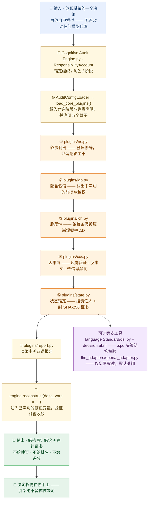

<p align="center">
  
  
  
  
</p>

<blockquote align="center">
  <em>全局认知审计引擎（GCAE）· 第二视角语言</em>
</blockquote>

<p align="center">
  <a href="README.md">English</a> | 简体中文
</p>

<div style="max-width:880px;margin:0 auto;padding:0 16px">

## ✦ 关于

<p style="font-size:15px;line-height:1.8;color:#2C2C2C">
<strong>全局认知审计引擎（GCAE）</strong>是全球首个中立的、核心离线的、与决策无关的认知偏差审计引擎。它为 AI 系统与企业决策提供独立的第三方安全与合规审计，且无需修改内部模型代码。
</p>

<p style="font-size:15px;line-height:1.8;color:#2C2C2C">
<strong>核心使命</strong> —— 一切不确定性、一切灾难、一切苦难，最终都源于我们对因果链的无知。该引擎通过系统性地识别隐含假设、客观不确定性与人类认知偏差，为高风险理性决策提供中立、可追溯的结构性支撑。
</p>

<p style="font-size:15px;line-height:1.8;color:#2C2C2C">
✅ <strong>已通过 IMDA AI Verify 评估，总分 95</strong> —— 完整报告见 <code>IMDA_AI_Verify_Causal_Audit_Report.pdf</code>。
</p>

</div>

## ✦ 引用

方法以公开技术报告（Version 1.0，2026）为准，引用格式：

> Ji, Zhichen. *Structural Auditing of Decision Claims: A Deterministic Offline Method and Its Reproducible Evidence Chain.* Zenodo, 2026. DOI: [10.5281/zenodo.23244508](https://doi.org/10.5281/zenodo.23244508)

存缴包——报告、Markdown 源、验证日志与完整源码快照——镜像于 [`docs/zenodo/deposit/`](./docs/zenodo/deposit/)。

<p align="center">— ✦ —</p>

## ✦ 系统架构

> **一句话：** GCAE 是一台**中立的决策体检机**——你描述一个决策，一串写明了名字的模块把它逐步拆开，最后交给你一份结构结论。它从不替你做决定。



**这张图怎么看**

1. **从上往下读，就是一次完整的审计。** 进去的是你自己写的决策描述，出来的只有结构结论 + 审计证书。
2. **每一步都写了干这件事的模块**（`plugins/ns.py` … `plugins/state.py`），可以对着图翻源码。五个算子顺序固定，不会跳步。
3. **输出刻意「克制」，旁支也是可选的。** 不给建议、不给排名、不给评分；DSL 校验器和 LLM 叙述适配器都在主链之外，叙述默认关闭，永远改不了判定。

📖 每个术语都用一句人话解释 → [术语表 GLOSSARY](./GLOSSARY.md)

## ✦ 在线演示

<div style="max-width:880px;margin:0 auto;padding:0 16px">

直接在浏览器中体验完整的五算子因果审计流水线 —— 零安装、零上传、完全确定性：

🌐 **在线演示**：[https://nohnlins.com/audit/](https://nohnlins.com/audit/)

> 完全在客户端运行。你的决策数据永不离开浏览器。

</div>

<p align="center">— ✦ —</p>

## ✦ 五大算子

<div style="max-width:880px;margin:0 auto;padding:0 16px">

每个算子都以插件形式位于 `plugins/` 下：

| 算子 | 插件 | 说明 |
|---|---|---|
| 叙事剥离（NS） | `plugins/ns.py` | 剥离修辞、情绪与模糊量词；提取逻辑内核 |
| 内隐假设透视（IAP） | `plugins/iap.py` | 揭示隐藏假设、特权绕过与循环论证 |
| 脆弱性闩锁（LCH） | `plugins/lch.py` | 计算每个假设的 ΔD 崩塌概率；定位最脆弱的变量 |
| 因果链同步（CCS） | `plugins/ccs.py` | 反向验证 + 反事实校验 + 黑洞检测 |
| 状态锚定（STATE） | `plugins/state.py` | 责任锚定 + SHA-256 审计证书 |

</div>

<p align="center">— ✦ —</p>

## ✦ 不变式公式

<div style="max-width:880px;margin:0 auto;padding:0 16px">

<p style="font-size:15px;line-height:1.8;color:#2C2C2C">
<strong>p → Q</strong> —— 其中 <strong>p</strong> 代表原则、规则或约束，<strong>Q</strong> 代表结果、状态或后果。箭头表示一种不可分割、连续、不可绕过的因果连接。
</p>

<p style="font-size:15px;line-height:1.8;color:#2C2C2C">
若 p 与 Q 之间的连续性被切断、遮蔽或被悄然改变，系统便不再处于治理之下 —— 而是处于叙事之下。
</p>

<p style="font-size:15px;line-height:1.8;color:#2C2C2C">
<strong>结构性审计谓词</strong> —— Φ{f_s, x, y} → {True, False}：基于系统函数 f_s 与输入条件 x、y，校验给定决策结构是否满足理性一致性的最低要求。它只产出审计结论，不产出建议或优化。
</p>

<p style="font-size:15px;line-height:1.8;color:#2C2C2C">
<strong>第二视角决策公式</strong> —— 一个有效决策是三段式结构：决策（D）· 假设前提（A）· 分支响应（ΔD），即 <strong>¬A ⇒ ΔD</strong>（当核心假设失效时，分支响应触发）。
</p>

</div>

## ✦ 核心特性

| 特性 | 说明 |
|---|---|
| 🛡️ **中立审计** | 100% 中立的第三方立场，不绑定任何 LLM 厂商 |
| 🔒 **核心离线** | 核心审计离线且确定性；LLM 增强为可选（默认关闭；启用需国内端点） |
| 🔐 **隐私优先** | 零用户数据收集，本地闭环数据隔离 |
| 🔍 **偏差检测** | 识别隐藏假设、不确定性与认知盲区 |
| 🔧 **无需改模型** | 兼容所有主流 LLM；无需改动源码 |
| 📊 **结构化分析** | 仅做决策结构校验；不产出主观结论 |

<p align="center">— ✦ —</p>

## ✦ 快速开始

```bash
# 主仓库：GitHub
git clone https://github.com/nohn3043-arch/second-perspective.git
# 镜像：Gitee（本仓库）
# git clone https://gitee.com/nohn-ecosystem/second-perspective.git
cd second-perspective
# 核心零依赖（仅需 Python 3.10+ 标准库，无需 pip install）
# 可选：pip install -r requirements-openai.txt   # OpenAI 叙述适配器

# ① 五算子端到端演示
python demo_audit.py

# ② 独立验证套件（零依赖 · 11 项检查 · 退出码可接 CI）
python verify.py
python verify.py --root    # 只打印链根，供跨机比对

# ③ 自验与评测设计指导（怎么核验引擎 + 怎么设计你自己的评测）
#    见 TESTING-zh.md —— 唯一测试入口（English: TESTING.md）
```

<p align="center">— ✦ —</p>

## ✦ 使用方法

<div style="max-width:880px;margin:0 auto;padding:0 16px">

引擎文件有意采用带空格的文件名 —— 用 `importlib` 加载：

```python
import importlib.util

spec = importlib.util.spec_from_file_location("ca", "cognitive audit engine.py")
ca = importlib.util.module_from_spec(spec)
spec.loader.exec_module(ca)

account = ca.ResponsibilityAccount(
    organization="audit_team",
    role="third_party_auditor",
    stage="review",
)

config = ca.AuditConfigLoader.load_from_dict({
    "allowed_stages": ["pre_decision", "in_decision", "post_decision", "review"],
    "disclaimer": "Structural audit only — does not replace human judgment.",
    "custom_fields": {"standard_version": "2026"},
})

engine = ca.CognitiveAuditEngine(account=account, config=config)
engine.load_core_plugins()               # 注册 NS / IAP / LCH / CCS / STATE

report = engine.audit(decision_context)  # 静态诊断

# 因果重建：注入修正变量并测试收敛
result = engine.reconstruct(decision_context, delta_vars={"assumption_x": False})
```

五个算子也可作为插件直接导入：

```python
from plugins import (
    NarrativeStripPlugin,
    ImplicitAssumptionPlugin,
    FragilityLatchPlugin,
    CausalChainSyncPlugin,
    StateAnchorPlugin,
)
```

可选的叙述生成适配器位于 [`llm_adapters/openai_adapter.py`](llm_adapters/openai_adapter.py)。

</div>

<p align="center">— ✦ —</p>

## ✦ 项目结构

```
second-perspective/
├── Cognitive Audit Engine.py      # 核心引擎（有意采用带空格的文件名）
├── demo_audit.py                  # 五算子端到端演示
├── verify.py                      # 独立验证套件（零依赖，11 项检查）
├── TESTING.md                     # 自验与评测设计指导（English · 主版）
├── TESTING-zh.md                  # 自验与评测设计指导（中文版 · 镜像）
├── plugins/                       # 五个算子插件
│   ├── ns.py                      #   叙事剥离
│   ├── iap.py                     #   内隐假设透视
│   ├── lch.py                     #   脆弱性闩锁
│   ├── ccs.py                     #   因果链同步
│   ├── state.py                   #   状态锚定
│   └── report.py                  #   双语报告渲染器
├── language Standard/             # 语言标准 2026
│   ├── 2026.md                    #   规范性标准（自然语言）
│   ├── grammar.md                 #   语法规范（英文版）
│   ├── grammar-zh.md              #   语法规范（中文版存档）
│   ├── decision.ebnf              #   形式文法（ISO/IEC 14977 EBNF）
│   ├── dsl.py                     #   校验器 + 造词器（零依赖 CLI）
│   └── examples/                  #   .spd 样本（合规 / 违规 / 生成，中英双语）
├── 全新决策结构语言.md            # 决策结构语言一页纸概览
├── docs/COMPLIANCE_SHANGHAI.md    # 上海合规说明
├── llm_adapters/openai_adapter.py # 可选的 OpenAI 叙述适配器
├── IMDA_AI_Verify_Causal_Audit_Report.pdf
├── requirements.txt · requirements-openai.txt
└── LICENSE
```

### 语言工具链

`language Standard/` 目录承载**决策结构语言** —— 一门只描述「一个决策在什么假设边界内成立」的
结构语言，不含任何执行语义。三层能力均已实测通过：**文法**（`decision.ebnf`）→ **校验器**
（`dsl.py check`）→ **样本造词器**（`dsl.py gen`）。

```bash
python "language Standard/dsl.py" check "language Standard/examples/valid_decision.spd"   # 通过，退出码 0
python "language Standard/dsl.py" check "language Standard/examples/invalid_decision.spd" # 失败，退出码 1
python "language Standard/dsl.py" gen --seed 2026 --count 5 --out samples/ --self-check
python "language Standard/dsl.py" codes                                                    # 19 条诊断码
```

零外部依赖，仅标准库，确定性（按 seed 可复现）。校验器内置**中英双语约束词库**，`gen` 支持
`--lang en|zh`；文档正文为英文，但中文 `.spd` 记录仍可被完整检出。依标准 *Constraints* 段，
校验器**拒绝**结论、建议、评分排序与优化引导类表述；造词器因此只产出**形式合法的样本**，
不产出任何建议。

<p align="center">— ✦ —</p>

## ✦ 生态

GCAE 是 NOHN AI 生态的一员 —— 一个围绕第二视角因果审计与确定性执行构建的项目家族：

| 项目 | 仓库 | 角色 |
|---|---|---|
| **Second-Perspective (GCAE)** | [nohn3043-arch/second-perspective](https://github.com/nohn3043-arch/second-perspective) | 全局认知审计引擎 —— 五算子因果审计内核（IMDA 95/100） |
| **NOMOS** | [nohn3043-arch/second-perspective](https://github.com/nohn3043-arch/second-perspective)（`Intelligent-Decision-Hub--Nomos` 分支） | 可审计的确定性决策中枢（IMDA 95/100） |
| **SPL-G1** | [nohn3043-arch/SPL-G1](https://github.com/nohn3043-arch/SPL-G1) | 硬件因果审计可信计算单元（TCU） |
| **SPL-Virtual-World-Base** | [nohn3043-arch/Second-Reality](https://github.com/nohn3043-arch/Second-Reality) | 虚拟世界与元宇宙基础设施（宪法 / 法律 / 桥） |
| **Story-Engine** | [nohn3043-arch/story-engine](https://github.com/nohn3043-arch/story-engine) | 长篇叙事一致性引擎 |
| **Antares** | [nohn3043-arch/Antares](https://github.com/nohn3043-arch/Antares) | GFSIP v1.0 —— 带因果审计的联邦稳定互操作协议 |
| **Anthropomorphic-Agent-Engine** | [nohn3043-arch/Anthropomorphic-Agent-Engine](https://github.com/nohn3043-arch/Anthropomorphic-Agent-Engine) | 确定性拟人心理引擎（SPL Pure Core V8.0） |
| **PAGES** | [nohn3043-arch/pages](https://github.com/nohn3043-arch/pages) | NOHN AI 生态官方落地页 |

<p align="center">— ✦ —</p>

## ✦ 许可与授权

本仓库是<strong>全局认知审计引擎（GCAE）</strong>的技术展示。本仓库<strong>并非开源</strong>。双轨模式：个人非商业研究免费；政府 / 企业使用需付费商业许可。详见 [LICENSE](./LICENSE)。

| 使用者 | 用途 | 许可要求 |
|---|---|---|
| 个人（自然人） | 非商业学术研究 / 学习 / 个人实验 | 依 [LICENSE](./LICENSE) "个人免费研究许可"，<strong>免费</strong> |
| 政府机构 / 公共事业单位 / 企业 | 任何用途（含内部部署、产品开发、对外服务） | <strong>须事先签署付费商业许可</strong> |

- **个人研究者**可免费用于非商业研究，但不得用于任何商业用途，也不得向任何企业或政府机构提供服务。
- **政府 / 企业用户**在签署商业许可协议并支付约定费用之前，不得复制、部署、运行、集成或分发本作品。
- **申请许可**：国际 / 全球 —— [ai@nohnlins.com](mailto:ai@nohnlins.com) · 中国 —— [lin@secondai.top](mailto:lin@secondai.top)

许可方、适用法律与争议解决依 [LICENSE](./LICENSE) 按用户所在地确定：中国境内用户 → 上海林明君华科技有限公司（中国法律）；中国境外用户 → NOHN AI TECHNOLOGY PTE. LTD.（新加坡法律，SIAC 仲裁）。

- **上海合规说明**：[COMPLIANCE_SHANGHAI](./docs/COMPLIANCE_SHANGHAI.md)
- **数据出境**：LLM 增强默认关闭；启用需国内端点 + 输入脱敏 + 用户同意，且必要时应依法开展数据出境安全评估。

### 洁净室声明

任何独立开发出与本作品核心功能、架构或决策模型实质性相似产品的当事方，均被推定为构成实质性衍生侵权，除非其能提供完整、连续、可追溯的独立开发证据。

**免责声明**：本语言系统仅用于决策过程中的结构审查与拆解。它不参与决策，也不介入最终决定。作者对任何后续执行结果不承担法律或运营责任。

<p align="center">
  <a href="https://github.com/nohn3043-arch">GitHub</a>
  &nbsp;·&nbsp;
  <a href="https://www.nohnlins.com/">nohnlins.com</a>
  &nbsp;·&nbsp;
  <a href="mailto:ai@nohnlins.com">ai@nohnlins.com</a>
</p>
<p align="center"><sub>NOHN AI · SECOND-PERSPECTIVE</sub></p>
