<p align="center">
  
</p>

<p align="center">
  
  
  
</p>

<blockquote align="center">
  <em>NOMOS · v0.5.0 — Second-Order Causal Decision Framework with LLM Guardrails</em>
</blockquote>

<p align="center">
  <a href="README-zh.md">简体中文</a> | English
</p>

<div style="max-width:880px;margin:0 auto;padding:0 16px">

## ✦ About

<p style="font-size:15px;line-height:1.8;color:#2C2C2C">
NOMOS is a <strong>second-order causal decision framework</strong> with a built-in auditable deterministic core and explicit LLM guardrails. It scored <strong>95/100</strong> in Singapore's <strong>IMDA AI Verify</strong> compliance assessment. The engine unifies structured evaluation, fine-grained algorithmic auditing, declared-assumption interaction (second-order causal composition), formally-bounded three-layer reconstruction with deterministic convergence proofs, counterfactual re-selection, declared-scenario stress testing, structured cognitive challenge, information prioritization, and human governance into a single hash-chained report.
</p>

<p style="font-size:15px;line-height:1.8;color:#2C2C2C">
It never invents missing facts, weights, thresholds, responsible parties, evidence, probabilities, <em>or interaction strengths</em>. Second-order effects (synergy, redundancy, amplification) must be <strong>explicitly declared by a responsible party</strong> — the engine never estimates or learns them. LLMs are restricted to a three-tier permission zone (Annotation / Proposal / Narrative) and can never flip status, adjudicate, or alter a weight by themselves. It produces candidates under declared inputs and always keeps the final verdict outside the algorithm.
</p>

<p align="center">
  
</p>

</div>

<p align="center">— ✦ —</p>

## ✦ Built-in Universal Audit Engine

<div style="max-width:880px;margin:0 auto;padding:0 16px">

<p style="font-size:15px;line-height:1.8;color:#2C2C2C">
NOMOS ships a <strong>universal audit engine</strong> — not a bolt-on patch. The audit trail is built into the deterministic core: every decision, assumption, constraint, and causal step is recorded, hash-linked, and independently verifiable by design.
</p>

<p style="font-size:15px;line-height:1.8;color:#2C2C2C">
It scored <strong>95/100</strong> in the causal-audit track of Singapore's <strong>IMDA AI Verify</strong>. The full compliance report is included as <code>IMDA_AI_Verify_Causal_Audit_Report.pdf</code>.
</p>

</div>

<p align="center">— ✦ —</p>

## ✦ Enterprise Integration

<p style="font-size:15px;line-height:1.8;color:#2C2C2C">
NOMOS is not a replacement for existing ERP/CRM/risk control/compliance/investment/HR/project-approval systems. It is the <strong>deterministic decision kernel</strong> embedded behind them: every upstream system submits structured requests with explicitly declared interactions and responsible parties; NOMOS returns candidates, counterfactuals, hash-chained audit trails, and formal convergence states; the final verdict is always signed by a human before it flows back into downstream audit, approval, and reporting flows.
</p>

```text
企业管理系统（ERP/CRM/风控/合规/投决/HR/项目审批）
        │
        │  提交结构化决策请求 + 已声明的交互 + 责任人
        ▼
   ┌─────────────────┐
   │  NOMOS v0.4     │  ← 确定性决策内核（本仓库）
   │  - 一阶失效     │     输出：候选集 + 反事实 + 审计链 + 收敛状态
   │  - 二阶交互     │
   │  - 三层重建     │     不输出最终结论——结论由人签
   │  - LLM 护栏     │
   └─────────────────┘
        │
        ▼
   审计留痕 / 审批流 / 合规报告 / LLM 辅助叙述（T3）
```

<p align="center">— ✦ —</p>

## ✦ What's New in v0.5 — Enterprise Control Plane

v0.5 closes the production gaps listed under *Production Boundaries* in v0.4. All additions are **env-gated and off by default**, so existing v0.4 deployments keep working unchanged until an operator opts in.

- **Persistent event store** — append-only, hash-linked `DomainEvent` log on every `evaluate`/`approve` (`persistence/event_store.py`), with a durable `PostgresEventStore`.
- **Tenant isolation** — `contextvars`-based active tenant resolved from `X-Tenant-Id` (or OIDC `tid`); per-tenant event partitioning. Legacy tables gain prepared `tenant_id` columns via `scripts/migrate.py`.
- **OIDC + authorization** — opt-in scope enforcement (`SP_AUTHZ_ENFORCE=true`) on write endpoints via `require_scope()`; layered on top of existing auth, inert by default.
- **KMS signing** — detached HMAC-SHA256 signatures over sealed artifact hashes (`security/kms.py`), surfaced as `X-Nomos-Kms-Signature`; no-op until `SP_KMS_SECRET` is set.
- **Rate limiting** — opt-in token-bucket middleware (`SP_RATE_LIMIT`).
- **Observability** — in-process metrics + `X-Process-Time-Ms`, snapshot at `GET /v1/metrics`.
- **Backups / migrations** — `scripts/migrate.py` (idempotent DDL) and `scripts/backup.py` (JSON export).
- **Domain control packs** — pluggable `DomainControlPack` protocol + registry; ships `FinanceRiskControlPack`. Packs observe only; they never alter the engine verdict.

## ✦ What's New in v0.4 — Second-Order Causal Framework

v0.4 is the first release that systematically reasons about <strong>assumption-to-assumption interactions</strong> rather than treating failures as independent events, pins the iterative reconstruction loop to <strong>formally-classified convergence states</strong> (proved, not heuristic), and places LLMs behind a <strong>three-tier permission gate</strong> that provably prevents LLM output from becoming adjudication.

- **Assumption Interaction Layer** (`interaction/`) — declared second-order effects (synergy / redundancy / amplification) with four invariants:
  - <strong>I-1 Non-conjectural</strong> — every interaction strength Δ is declared by a responsible party; the engine never estimates or learns Δ.
  - <strong>I-2 Order-conservation</strong> — interactions fire only when <em>all</em> member assumptions are simultaneously invalidated; partial failure does not trigger second-order effect.
  - <strong>I-3 Effect-boundedness</strong> — cumulative interaction effect ≤ `amplification_ceiling × Σ|first-order|`; redundant (negative) interactions are not floor-clamped, allowing genuine damping.
  - <strong>I-4 Monotonicity</strong> — augmenting the invalidated set never un-triggers an already-fired interaction (union semantics).
- **Formal Convergence Engine** (`convergence/`) — replaces heuristic stop checks with a five-state classification (`FIXED_POINT` / `NO_GAIN` / `BUDGET_EXHAUSTED` / `DIVERGED` / `BLOCKED`) backed by three checkable propositions (P-1 Termination, P-2 Fixed-point, P-3 Effect-boundedness). `is_true_convergence` guards against the classic bug of misclassifying budget exhaustion as convergence.
- **LLM Compliance Layer** (`llm_compliance/`) — three permission tiers (T1 Annotation / T2 Proposal / T3 Narrative), three invariants (zone isolation, no adjudication, strength stripping), and a provenance-tracked `LLMGate` that strips structural power from every LLM response before it can touch the decision graph.
- **Core integration** — `DecisionRequest` gains an optional `interaction_declaration` field (default `None`, fully backward compatible); `invalidation_closure_with_interaction()` composes first-order closure with second-order joint effect; the session engine delegates stop-condition checks to the formal `ConvergenceChecker`.
- **Backward compatibility preserved** — when `interaction_declaration` is not supplied, the engine behaves identically to v0.4. No existing APIs removed or renamed. GCAE audit engine untouched.

Tests: 412 passing (added 132), 0 failures. Full change log: [`CHANGELOG.md`](./CHANGELOG.md).
Architecture: [`docs/INTELLIGENT_DECISION_HUB_V0_4.md`](docs/INTELLIGENT_DECISION_HUB_V0_4.md).

## ✦ Three-Layer Causal Reconstruction (Bounded Convergence + Human Gate)

New in `hub/session.py` (`ReconstructionSessionEngine`) and `decision/reconstruction.py` (`reconstruct_with_delta`): the previously one-shot causal reconstruction is upgraded into a **bounded, hash-chained, human-gated iterative process**.

Each round runs the three causal operators:

1. **Forward invalidation propagation** — `invalidation_closure` propagates a declared assumption failure forward, dropping alternatives that lose that assumption's support.
2. **Backward root-cause tracing** — the existing reverse BFS traces deviation signals back to a candidate set of root-cause hypotheses.
3. **Delta reconstruction** — declared correction variables (`DeltaVar`) are applied to a copy of the request, the deterministic evaluator is re-run, and convergence of the leading candidate set is judged.

Design invariants (aligned with the NOMOS core):

- **No guessing** — every hypothesis is a candidate; a human decides. The engine never auto-loops.
- **Deterministic** — each round derives exclusively from declared inputs.
- **Auditable** — every round is hash-linked to the previous one; the whole session forms a `session_root_hash`.
- **Bounded** — capped by `max_iterations` and `max_evidence_requests`.
- **Human gate** — `advance()` performs exactly one round and then stops at `AWAITING_HUMAN`; only a human decision (`approve` / supply evidence / reject) may move to the next round.

Stop conditions are <strong>formally classified</strong> by the `ConvergenceChecker` into five states:
- <strong>True convergence</strong>: `FIXED_POINT` (candidate set identical to previous round — P-2 proof) or `NO_GAIN` (no unresolved branches).
- <strong>Not convergence</strong>: `BUDGET_EXHAUSTED` (budget ran out before a fixed point was reached — explicitly <em>not</em> convergence and must not be reported as such), `DIVERGED` (still changing with budget remaining), `BLOCKED` (structural block hit, requires human).

```python
from second_perspective.models import DecisionRequest, DeviationSignal, DeltaVar
from second_perspective.hub.session import ReconstructionSessionEngine

engine = ReconstructionSessionEngine()
session = engine.start(request, signals, max_iterations=5)
session = engine.advance(session)                                   # round 1: three-layer reconstruction
session = engine.advance(session, [                                 # inject a declared correction
    DeltaVar(path="A2", value=None, reason="...", responsibility="..."),
])
session = engine.human_decision(session, approved=True)             # human seal
print(session.session_root_hash)
```

A `DeltaVar` path may take three forms: `"A2"` (falsify an assumption, propagated through the dependency graph), `"criteria.K1.weight"` (rewrite a criterion weight), or `"alternatives.S1.metrics.cost"` (rewrite an alternative metric). The engine mirrors each declared `DeltaVar` verbatim and never invents corrections.

## ✦ Architecture

> **In one sentence:** NOMOS sits behind your existing business systems as a **deterministic decision kernel** — a request walks down a fixed pipeline of real modules, and the verdict is always signed by a human.

```mermaid
flowchart TB
    UP["Upstream business systems (callers)<br/>ERP · CRM · risk · compliance · approvals · HR"]

    A1["🚪 api/main.py · security.py<br/>accept request · auth · rate limit · tenant isolation"]
    A2["🔎 decision/evaluator · integrity<br/>structure / evidence audit"]
    A3["⚖️ decision/policy<br/>hard + soft constraints"]
    A4["📊 decision/engine · causal<br/>normalized scoring → first-order invalidation"]
    A5["🔗 interaction/engine<br/>second-order interaction · invariants I-1 … I-4"]
    A6["🧩 decision/reconstruction · hub/session<br/>three-layer rebuild: forward / backward / delta"]
    A7["✅ convergence/checker<br/>5-state verdict: fixed-point / no-gain /<br/>budget-exhausted / diverged / blocked"]
    A8["🔄 decision/counterfactual · selection · robustness<br/>counterfactual re-selection · Pareto · weight sensitivity"]
    A9["🛡️ llm_compliance/gate<br/>T1 annotate / T2 propose / T3 narrate · an LLM never adjudicates"]
    A10["📒 audit/ledger · persistence/event_store<br/>hash-chained audit + append-only event log"]
    OUT["📦 sealed HubReport + session_root_hash"]
    HUMAN["✍️ governance/approval<br/>a human signs off — the verdict stays outside the algorithm"]

    UP --> A1
    A1 --> A2
    A2 --> A3
    A3 --> A4
    A4 --> A5
    A5 --> A6
    A6 --> A7
    A7 --> A8
    A8 --> A9
    A9 --> A10
    A10 --> OUT
    OUT --> HUMAN

    classDef cUp fill:#F5F5F5,stroke:#9E9E9E,stroke-width:1px,color:#424242
    classDef cIn fill:#E8F0FE,stroke:#4285F4,stroke-width:1px,color:#173A66
    classDef cCore fill:#FFF8E1,stroke:#C9A96E,stroke-width:1px,color:#5B4614
    classDef cGate fill:#F3E8FD,stroke:#8E44AD,stroke-width:1px,color:#4A235A
    classDef cOut fill:#E6F4EA,stroke:#34A853,stroke-width:1px,color:#14512B
    class UP cUp
    class A1 cIn
    class A2,A3,A4,A5,A6,A7,A8 cCore
    class A9,A10 cGate
    class OUT,HUMAN cOut
```



**How to read it**

1. **Top to bottom is one request's journey.** What goes in is a `DecisionRequest`; what comes out is a sealed `HubReport` carrying a `session_root_hash`.
2. **Every box names the real module doing the work**, so you can jump straight from the diagram to the source file. The golden boxes are pure deterministic computation.
3. **The purple boxes are the boundary.** The LLM may only annotate / propose / narrate and can never flip a status or a ranking; the audit trail is hash-chained; the final signature is the green step — never the algorithm.

📖 Every term explained in one plain sentence → [Glossary](./GLOSSARY.md)

**The full pipeline, in detail**

```text
HubAnalysisRequest (+ optional InteractionDeclaration)
  -> Decision Core
       -> Structure / Evidence Audit
       -> Hard + Soft Constraint Evaluation
       -> Normalized Scoring
       -> Causal Invalidation (first-order)
       -> Assumption Interaction Layer (second-order: conjunctive / disjunctive)
            -> I-1 Non-conjectural · I-2 Order-conservation · I-3 Effect-bounded · I-4 Monotone
       -> Three-Layer Reconstruction (forward / backward / delta)
            -> Formal Convergence Checker (P-1/P-2/P-3 → 5-state classification)
       -> Counterfactual Re-selection
       -> Pareto + Weight Sensitivity
       -> Hash-Chained Algorithm Audit
  -> LLM Gate (T1 Annotation / T2 Proposal / T3 Narrative; provenance-tracked, status-stripped)
  -> Declared-Scenario Stress Runs
  -> Structured Cognitive Risk Challenge
  -> Information Prioritization Queue
  -> Append-only DecisionRecord
  -> Sealed HubReport (session_root_hash)
  -> Human Approve / Reject (final verdict always outside the algorithm)
```

## ✦ Install & Test

```bash
python -m venv .venv
source .venv/bin/activate        # Windows: .venv\Scripts\activate
pip install -e ".[dev]"
pytest
```

## ✦ Run the Demos

Core decision core:

```bash
nomos-demo
```

Prints a human-readable decision summary. Use `--decision <file>` to run any
decision JSON in `examples/` (e.g. `nomos-demo --decision examples/baidu_org.json`)
and `--json` for the full machine-readable result:

```bash
nomos-demo --decision examples/baidu_org.json --json
```

NOMOS (Intelligent Decision Hub) with two stress scenarios:

```bash
nomos-hub-demo
```

## ✦ Python Usage

```python
from second_perspective import IntelligentDecisionHub
from second_perspective.models import HubAnalysisRequest

request = HubAnalysisRequest.model_validate(
    {
        "decision": decision_payload,
        "scenarios": [
            {"id": "SC1", "name": "Critical assumption failure", "failed_assumption_ids": ["A1"]},
            {"id": "SC2", "name": "Cost shock", "metric_overrides": {"S2": {"capital_required": 6000000}}},
        ],
    }
)
report = IntelligentDecisionHub().analyze(request)
```

The returned report contains the baseline decision record, scenario results, cognitive findings, information priorities, algorithm-ledger verification status, policy snapshot, and report hash.

## ✦ Run the API

Local development runs keyless:

```bash
export SP_ENV=development
uvicorn second_perspective.api.main:app --reload
```

Production refuses to boot without a key:

```bash
export SP_ENV=production
export SP_API_KEY="replace-with-a-strong-secret"
uvicorn second_perspective.api.main:app --host 0.0.0.0 --port 8000
```

Protected clients send `Authorization: Bearer <SP_API_KEY>`.

Endpoints:

- `GET /health`
- `GET /v1/auth/me`
- `POST /v1/hub/analyze`
- `GET /v1/hub/reports/{hub_run_id}`
- `POST /v1/decisions/evaluate`
- `GET /v1/decisions/{decision_id}`
- `GET /v1/decisions/{decision_id}/history`
- `POST /v1/decisions/{decision_id}/approval`

Optional PostgreSQL persistence: set `SP_DATABASE_DSN` (`asyncpg`); OIDC-aware identity: set `SP_OIDC_ISSUER`.

## ✦ Regenerate the OpenAPI Schema

```bash
SP_PUBLIC_BASE_URL=https://decision.example.com \
python scripts/export_openapi.py
```

## ✦ Compatibility

All v0.2 decision requests and endpoints remain valid. Responses add `counterfactuals`, `algorithm_audit`, `algorithm_audit_root_hash`. Clients that strictly deserialize response fields must update their models.

## ✦ Production Boundaries

v0.5 is a feature-complete <em>deterministic decision framework</em> with an enterprise control plane. The second-order causal layer, formal convergence, and LLM guardrails remain production-grade. The control-plane capabilities listed above (persistent event store, tenant isolation, OIDC + authorization enforcement, KMS signing, rate limiting, observability, backups/migrations, domain control packs) ship in v0.5 and are **opt-in** via environment configuration.

Remaining production hardening (not yet bundled): a shared/cloud rate-limit store (e.g. Redis), envelope encryption via a cloud KMS, document-level (not just event-level) per-tenant partitioning, multi-region HA, and SLA tooling.

Hard boundaries (invariants, not future work):
- The engine never estimates missing interaction strengths, weights, probabilities, or responsible parties.
- <strong>LLMs never adjudicate</strong>: T2 proposals require explicit human approval; T3 narrative is stripped from the decision graph; no LLM output can flip an assumption state or an alternative's rank.
- `BUDGET_EXHAUSTED` is reported as <em>non-convergence</em>; clients may not mislabel it as convergence.
- The cognitive scanner only challenges structural risk. It does not diagnose people, read motives, or replace legal, medical, financial, or security professionals.

## ✦ Project Structure

```
nomos/
├── pyproject.toml              # package: nomos-decision-engine v0.4.0
├── CHANGELOG.md                # versioned change log
├── src/second_perspective/
│   ├── cli.py / hub_cli.py     # demo entry points (nomos-demo / nomos-hub-demo)
│   ├── service.py / repository.py / canonical.py / version.py
│   ├── api/                    # FastAPI: main.py, security.py
│   ├── audit/                  # auditor, execution, graph, ledger
│   ├── convergence/            # checker (5-state classification), propositions (P-1/P-2/P-3), enums
│   ├── decision/               # causal, counterfactual, engine, evaluator,
│   │                           #   integrity, policy, robustness, selection,
│   │                           #   reconstruction (three-layer)
│   ├── governance/             # approval
│   ├── hub/                    # orchestrator, cognitive, information, integrity,
│   │                           #   policy, repository, scenario, session (gate)
│   ├── interaction/            # engine (I-1..I-4), model, validator, types
│   ├── llm_compliance/         # gate (T1/T2/T3), invariants (L-1..L-3), provenance, types
│   ├── models/                 # enums, hub, schemas
│   └── persistence/            # asyncpg PostgreSQL repository (SP_DATABASE_DSN)
├── docs/                       # DECISION_FOUNDATION_V0_2.md, INTELLIGENT_DECISION_HUB_V0_3.md,
│                               #   INTELLIGENT_DECISION_HUB_V0_4.md
├── examples/market_entry.json  # sample decision request
├── scripts/export_openapi.py
├── tests/                      # test_api / test_engine / test_hub / test_interaction /
│                               #   test_convergence / test_llm_compliance / test_v04_integration
├── Dockerfile · docker-compose.yml · openapi-action.yaml
├── requirements-engine.txt · requirements-engine-dev.txt
├── IMDA_AI_Verify_Causal_Audit_Report.pdf
└── assets/                     # banner.svg/png, overview.svg/png
```

<p align="center">— ✦ —</p>

## ✦ Ecosystem

NOMOS is a member of the NOHN AI ecosystem — a family of projects built around second-perspective causal auditing and deterministic execution:

| Project | Repository | Role |
|---|---|---|
| **Second-Perspective (GCAE)** | [nohn3043-arch/second-perspective](https://github.com/nohn3043-arch/second-perspective) | Global cognitive audit engine — ten-operator causal audit kernel (IMDA 95/100) |
| **NOMOS** | [nohn3043-arch/second-perspective](https://github.com/nohn3043-arch/second-perspective) (`Intelligent-Decision-Hub--Nomos` branch) | Auditable deterministic decision hub (IMDA 95/100) |
| **SPL-G1** | [nohn3043-arch/SPL-G1](https://github.com/nohn3043-arch/SPL-G1) | Hardware causal-audit trusted compute unit (TCU) |
| **SPL-Virtual-World-Base** | [nohn3043-arch/Second-Reality](https://github.com/nohn3043-arch/Second-Reality) | Virtual-world and metaverse infrastructure (constitution / law / bridge) |
| **Story-Engine** | [nohn3043-arch/story-engine](https://github.com/nohn3043-arch/story-engine) | Long-form narrative consistency engine |
| **Antares** | [nohn3043-arch/Antares](https://github.com/nohn3043-arch/Antares) | GFSIP v1.0 — causally-audited federated stable-interop protocol |
| **Anthropomorphic-Agent-Engine** | [nohn3043-arch/Anthropomorphic-Agent-Engine](https://github.com/nohn3043-arch/Anthropomorphic-Agent-Engine) | Deterministic anthropomorphic psychology engine (SPL Pure Core V8.0) |
| **PAGES** | [nohn3043-arch/pages](https://github.com/nohn3043-arch/pages) | Official NOHN AI ecosystem landing page |

<p align="center">— ✦ —</p>

## ✦ License & Authorization

This repository is **not open source**. Dual-track: free for personal non-commercial research; government / enterprise requires a paid commercial license. See [LICENSE](./LICENSE) — the licensor and applicable law depend on the user's location (within China → Shanghai Linming Junhua Technology Co., Ltd., PRC law; outside → NOHN AI TECHNOLOGY PTE. LTD., Singapore law + SIAC arbitration).

- **Request a license**: International / Global — [ai@nohnlins.com](mailto:ai@nohnlins.com) · China — [lin@secondai.top](mailto:lin@secondai.top)

Compliance documents:

China (PRC):

- [Shanghai compliance note](./docs/COMPLIANCE_SHANGHAI.md)
- [Privacy policy (CN)](./docs/PRIVACY_POLICY_CN.md)
- [Data processing agreement (CN)](./docs/DATA_PROCESSING_AGREEMENT_CN.md)

International / Global:

- [EU AI Act compliance note](./docs/COMPLIANCE_EU_AI_ACT.md)
- [Privacy policy (International · GDPR)](./docs/PRIVACY_POLICY_INTL.md)
- [Data processing agreement (International · GDPR)](./docs/DATA_PROCESSING_AGREEMENT_INTL.md)
- [Privacy policy (Singapore · PDPA)](./docs/PRIVACY_POLICY_SG_PDPA.md)

Framework alignment (non-binding references):

- [NIST AI RMF 1.0 mapping](./docs/COMPLIANCE_NIST_AI_RMF.md)
- [ISO/IEC 42001:2023 alignment](./docs/COMPLIANCE_ISO_42001.md)

<p align="center">
  <a href="https://github.com/nohn3043-arch">GitHub</a> · <a href="https://www.nohnlins.com">Website</a> · <a href="mailto:ai@nohnlins.com">ai@nohnlins.com</a>
</p>
<p align="center"><sub>NOHN AI · NOMOS</sub></p>
