<p align="center">
  
  
  
  
</p>

<blockquote align="center">
  <em>Global Cognitive Audit Engine (GCAE) · Second Perspective Engine 1.2 · Second-Perspective Language</em>
</blockquote>

<p align="center">
  <a href="README-zh.md">简体中文</a> | English
</p>

<div style="max-width:880px;margin:0 auto;padding:0 16px">

## ✦ About

<p style="font-size:15px;line-height:1.8;color:#2C2C2C">
<strong>Global Cognitive Audit Engine (GCAE)</strong> is the world's first neutral, core-offline, decision-agnostic cognitive-bias audit engine. It provides independent third-party security and compliance auditing for AI systems and enterprise decisions, without requiring modification of internal model code.
</p>

<p style="font-size:15px;line-height:1.8;color:#2C2C2C">
<strong>Core mission</strong> — all uncertainty, all disasters, all suffering ultimately stem from our ignorance of causal chains. The engine provides neutral, traceable structural support for high-stakes rational decisions by systematically identifying implicit assumptions, objective uncertainty, and human cognitive biases.
</p>

<p style="font-size:15px;line-height:1.8;color:#2C2C2C">
✅ <strong>Passed IMDA AI Verify assessment, total score 95</strong> — full report in <code>IMDA_AI_Verify_Causal_Audit_Report.pdf</code>.
</p>

</div>

## ✦ Citation

The method is specified in the public technical report (Version 1.0, 2026). Cite it as:

> Ji, Zhichen. *Structural Auditing of Decision Claims: A Deterministic Offline Method and Its Reproducible Evidence Chain.* Zenodo, 2026. DOI: [10.5281/zenodo.23244508](https://doi.org/10.5281/zenodo.23244508)

The deposit — report, Markdown source, verification log, and the complete source snapshot — is mirrored in [`docs/zenodo/deposit/`](./docs/zenodo/deposit/).

<p align="center">— ✦ —</p>

## ✦ Architecture

> **In one sentence:** GCAE is a **neutral auditor for decisions** — you describe a decision, and a chain of named modules takes it apart step by step, then hands you a structural verdict. It never decides for you.

```mermaid
flowchart TB
    IN["💬 Input — a decision you are about to make<br/>described in your own words · no model code changes"]

    E1["🧠 Second Perspective Engine.py · ResponsibilityAccount<br/>anchor organisation / role / stage"]
    E2["⚙️ AuditConfigLoader → load_core_plugins()<br/>load allowed stages + disclaimer,<br/>then register the ten operators"]

    A0["⊙ Zone ③ · GA<br/>Genesis Anchor — origin event · target state · energy constraints"]
    A1["⊗ Zone ③ · NS<br/>Narrative Stripping — delete rhetoric, keep the logical core"]
    A2["⊕ Zone ③ · IAP<br/>Implicit Assumption — surface undeclared premises and privilege bypass"]
    A3["⊿ Zone ③ · LCH<br/>Fragility Localization — score each assumption's collapse risk ΔD"]
    A6["⊞ Zone ③ · LFT<br/>Label-Free Topology — build □/→/⦿ + four parallel checks"]
    A8["BFC Zone ③ · BFC<br/>Binary Fact Check — reduce a claim to true/false, never a third value"]
    A4["⚙️ Zone ③ · CCS<br/>Chain Closure Scan — reverse check · counterfactual · black-hole detection"]
    A7["⇄ Zone ③ · GRF<br/>Gray Feedback — rollout ladder + reality falsification alignment"]
    A9["META Zone ③ · META<br/>Meta-Causal Ledger — Hundun / Wuji / Xuhuan A6 / Tiandao A10 / Lunhui (measures only, never blocks)"]
    A5["⊚ Zone ③ · ACC<br/>Accountability Anchoring — pin responsibility + seal a SHA-256 certificate"]

    R["🧾 Zone ⑤ · ReportRenderer<br/>render the bilingual report"]
    RC["↻ engine.spiral(approved_deltas = …)<br/>superimposed spiral: freeze converged subgraph + detect origin drift"]
    RC2["⊛ engine.reconstruct(delta_vars = …)<br/>linear reconstruction (single layer, overwrite, v1-compatible)"]
    RC3["⊛∞ engine.evolve(…)<br/>autonomous evolution: emit proposals for discovered gaps,<br/>never rewrite its own adjudication rules"]

    SIDE["Optional side tools<br/>language Standard/dsl.py + decision.ebnf + topology.ebnf — .spd / .tpg checks (the only toolchain outside the engine)"]

    OUT["📄 Output — structural verdict + audit certificate<br/>no advice · no ranking · no score"]
    HUMAN["👤 You still decide — the engine never decides for you"]

    IN --> E1
    E1 --> E2
    E2 --> A0
    A0 --> A1
    A1 --> A2
    A2 --> A3
    A3 --> A6
    A6 --> A8
    A8 --> A4
    A4 --> A7
    A7 --> A9
    A9 --> A5
    A5 --> R
    R --> RC
    R --> RC2
    R --> RC3
    RC --> OUT
    RC2 --> OUT
    RC3 --> OUT
    OUT --> HUMAN
    A5 -.-> SIDE

    classDef cIn fill:#E8F0FE,stroke:#4285F4,stroke-width:1px,color:#173A66
    classDef cEng fill:#FFF8E1,stroke:#C9A96E,stroke-width:1px,color:#5B4614
    classDef cOp fill:#FFF3E0,stroke:#E67E22,stroke-width:1px,color:#7A3E00
    classDef cSide fill:#F3E8FD,stroke:#8E44AD,stroke-width:1px,color:#4A235A
    classDef cOut fill:#E6F4EA,stroke:#34A853,stroke-width:1px,color:#14512B
    class IN cIn
    class E1,E2,R,RC,RC2,RC3 cEng
    class A0,A1,A2,A3,A4,A5,A6,A7,A8,A9 cOp
    class SIDE cSide
    class OUT,HUMAN cOut
```



**How to read it**

1. **Top to bottom is one audit run.** Your own description goes in; a structural verdict plus a certificate comes out — nothing else.
2. **Every step names the operator that does it** (Zone ③, `GA` through `ACC`), so you can read the diagram and the source side by side. The ten operators always run in the order fixed by `PIPELINE_ORDER`. `META` sits between `GRF` and `ACC`: it needs all four upstream results before it can settle the five meta-grounds.
3. **Three exits, and their semantics never interfere.** `spiral()` superimposes layers, freezes the converged subgraph and detects origin drift; `reconstruct()` keeps the v1 linear overwrite semantics; `evolve()` only emits proposals and bumps the generation — it **never touches the adjudication rules**.
4. **The output is deliberately modest, and the side tools are optional.** No advice, no ranking, no score — the `.spd` / `.tpg` checker sits outside the engine, and the narration layer is off by default and can never change a verdict.

📖 Every term explained in one plain sentence → [Glossary](./GLOSSARY.md)

## ✦ Live Demo

<div style="max-width:880px;margin:0 auto;padding:0 16px">

Experience the full causal audit pipeline directly in your browser — zero installation, zero upload, fully deterministic:

🌐 **Live demo**: [https://nohnlins.com/audit/](https://nohnlins.com/audit/)

> Runs entirely client-side. Your decision data never leaves the browser.

</div>

<p align="center">— ✦ —</p>

## ✦ Ten Operators

<div style="max-width:880px;margin:0 auto;padding:0 16px">

All ten operators are inlined in **Zone ③** of the engine — there is no `plugins/` package
in this repository. The first five carry over from Standard 2026.1; the next four are the
2026.2 topology layer; the last one, META, is the **2026.3 meta-causal layer** —
an explicit **grammar extension 2026.3**, declared in `language Standard/topology.ebnf`:

| Operator | Symbol | Class in engine | Description |
|---|---|---|---|
| Genesis Anchor (GA) | ⊙ | `OriginAnchorPlugin` | Anchor origin event / target state / energy constraints; an origin vacuum blocks |
| Narrative Stripping (NS) | ⊗ | `NarrativeStripPlugin` | Strip rhetoric, emotion, and vague quantifiers; extract the logical core |
| Implicit Assumption (IAP) | ⊕ | `ImplicitAssumptionPlugin` | Reveal hidden assumptions, privilege bypass, and circular reasoning |
| Fragility Localization (LCH) | ⊿ | `FragilityLatchPlugin` | Compute the ΔD collapse probability of each assumption; find the most fragile variable |
| Label-Free Topology (LFT) | ⊞ | `TopologyGraphPlugin` | Build the de-semantic □/→/⦿ topology; run **four** parallel checks |
| Binary Fact Check (BFC) | — (letter code) | `BinaryFactCheckPlugin` | Reduce a claim to **true / false**; an evidence vacuum or contradiction blocks, never a third value |
| Chain Closure Scan (CCS) | ⚙ | `CausalChainSyncPlugin` | Reverse verification + counterfactual validation + black-hole detection |
| Gray Feedback (GRF) | ⇄ | `GrayFeedbackPlugin` | Rollout ladder + reality falsification alignment; falsified with no branch blocks |
| Meta-Causal Ledger (META) | — (letter code) | `MetaCausalLedgerPlugin` | Hundun · Unparsed Antecedence / Wuji · Non-forking Convergence / Xuhuan · Narrative Register A6 / Tiandao · Neutrality Invariant A10 / Lunhui · Effect-to-Cause Succession — five meta-grounds as ledgers; **never blocks** |
| Accountability Anchoring (ACC) | ⊚ | `StateAnchorPlugin` | Responsibility anchoring + SHA-256 audit certificate |

**Why META gets a letter code and not a glyph**: it is a **ledger of measures**, placed on the
`T2_SIGNAL` tier, so it is structurally incapable of flipping a verdict. Giving it a symbol like
⦿ would suggest a new axiom. A number that looks bad and an input that is missing are two
different things — only the latter halts a derivation.

**How BFC differs from GRF** (both ask about falsification, but not the same question):

| Module | Question | Layer |
|---|---|---|
| ⇄ GRF | Reality fed back — does the **structure have a fallback path ΔD**? | behaviour |
| BFC | Does this claim **have evidence, do the sources contradict, what is the verdict**? | cognition |

BFC is **off by default**: without `facts` it passes through untouched (`status = SKIPPED`), so
existing verdicts and chain roots do not move. It admits exactly two truth values —
`binary=None` means "not declared", always accompanied by a `VERDICT_UNDECLARED` signal and
never counted as a third truth value in any decision.

### Topology symbols (de-semantic)

A symbol carries no semantics; semantics is produced when operators act on it.
The labels △/◇ are **relative** and never take part in adjudication.

| Symbol | Topological meaning | Constraint |
|---|---|---|
| `□` | entity node | no intrinsic attribute; vanishes once every incident edge is deleted |
| `→` | causal directed edge | may carry `weight` / `validity` parameters |
| `t` | chain-internal time order (axiom 5) | optional; when absent it is derived by **longest path**. A declared value must lie in `[t(src), t(dst)-1]` |
| `⦿` | global axiom constraint | immutable, globally in force |
| `△` | upstream node (relative label) | a falsifiable input assumption to its downstream |
| `◇` | downstream node (relative label) | an untamperable output decision to its upstream |

`t` is not a timestamp; it is "which link of this chain". Normative axiom 5 makes time a
**constitutive condition** rather than a detachable field: "without this premise, the very concept
of a *chain* cannot stand". So multiple roots (parallel chains) are **legal**; the same ordered pair
declared twice (a fork) is **not**; and a directed cycle leaves the order unassignable, so the chain
does not stand at all.

### Four parallel checks

| Check | Rule | Severity |
|---|---|---|
| consistency | node identities globally unique; no self-contradictory edge definition | **fatal** — halts the derivation |
| constraint | every edge parameter satisfies ⦿, nothing out of range | **fatal** — halts the derivation |
| closure | no dangling node/edge, no causal paradox (self-loops included) | warning — may be forced through, but the **result is void** |
| time_order | no fork (T305), order not inverted (T307), order assignable (T308) | warning — may be forced through, but the **result is void** |

Time order is a process of its own rather than part of closure, because the questions differ:
closure asks *is the graph self-consistent*, time order asks *is this graph still a chain*.
They can fail independently, and merging them would bury one real question.

### The meta-causal ledger (Hundun · Wuji · Xuhuan · Tiandao · Lunhui)

The five meta-grounds of the normative reference's clause 6 become five computable ledgers.
They measure; they never adjudicate:

| Meta-base | Realised as | Criterion |
|---|---|---|
| Hundun · Unparsed Antecedence | gap ledger `chaos_gaps` | "Chance" is not in Hundun, **only in the observer's knowledge gap**. Calling an unresolved antecedent "luck" raises high risk |
| Wuji · Non-forking Convergence | parallel chains | Parallel (many roots) is legal; a fork (one pair, many edges) is not. The limit converges uniquely: S∞ = S* |
| Xuhuan · Narrative Register | **A6 narrative entropy** | masked chars / total chars — a rational, never a probability. The reality face (⇄GRF) is recorded alongside it |
| Tiandao · Neutrality Invariant | **A10 audit entropy** | provenance entries per layer (discrete d(version)/dt). A **bounded** A10 is what lets evolution converge to S* |
| Lunhui · Effect-to-Cause Succession | succession integrity | Not the chain's self-loop but its universal succession: every effect becomes the next cause, order never inverted |

### Orchestration: linear vs spiral vs autonomous evolution

| Entry point | Semantics | Halting criterion |
|---|---|---|
| `engine.reconstruct()` | ⊛ linear: each round `ctx.update()` overwrites the previous one | adjacent risk sets identical (fixed point) |
| `engine.spiral()` | ↻ spiral: freeze the converged subgraph + origin-drift detection + hard energy budget | fixed point **and** no origin drift |
| `engine.limit_reconstruct()` | ∞ limit: no cap on layer count | distance stays zero across layers → S∞ = S* reached |
| `engine.evolve()` | ⊛∞ autonomous evolution: **discovers** structural gaps, emits proposals | minimal fixed point `g_{n+1} == g_n` (graph isomorphism) |

**Why `evolve()` refuses to rewrite itself**: the moment an engine can change its own adjudication
rules, a third party can no longer "recompute the same root from the same code" — the certificate
degrades into a self-signed sheet of paper. Three identities are therefore hard-coded into the
return value: `applies_automatically = False` · `requires_human = True` · `auto_applied = 0`.
Human adjudication goes through `approve_evolution_proposal()`, which **only keeps the books
(bumps the generation)** and returns `applied_to_code = False` — changing code is a human's job.

</div>

<p align="center">— ✦ —</p>

## ✦ Capability Boundary (what it blocks · what it does not)

<div style="max-width:880px;margin:0 auto;padding:0 16px">

This engine **makes no guarantees — it verifies structure**. The boundary therefore has to be
written down: presenting what it does *not* block as if it did is the fastest way to fail on delivery.

### 1. What it blocks (hard mechanisms, not rhetoric)

| Mechanism | What it blocks | Severity |
|---|---|---|
| **LLM never adjudicates** | Any `status` / `converged` / `verdict` / `weight` / `rank` in model output is **stripped and traced**; no LLM output can flip an assumption's state or an option's ranking | structural |
| **I-1 no guessing** | Missing facts / weights / thresholds / owners are **not estimated** — the audit halts and lists what must be supplied | `BLOCKED` |
| ⊕ IAP assumption mining | undeclared premises, privilege bypass, circular reasoning | signal |
| BFC binary fact check | evidence vacuum · mutually negating evidence · falsified premise still in use | `BLOCKED` |
| ⇄ GRF reality feedback | reality already falsified an assumption while **no fallback path ΔD** exists; no rollout ladder | `BLOCKED` / warning |
| ⊞ LFT topology checks | identity conflicts, out-of-range parameters (fatal); dangling node/edge, causal paradox (result void) | fatal / warning |
| Chain-internal time order (axiom 5) | inverted order; one node pair with multiple edges (a fork); unassignable order from a cycle | warning, result void |
| ⊚ ACC responsibility anchoring | missing owner; vague responsible party | `BLOCKED` |
| **Reproducible certificate** | same input + same nonce + same clock → **same chain root**, recomputable on another machine, bound to no model vendor. Since SPE 1.2 the signature also carries `input_digest = SHA-256(canonical-JSON(input))`, so "this certificate corresponds to **this** input" is independently checkable | verifiable |

### 2. What it does NOT block (explicit non-commitments)

| Not committed | Why |
|---|---|
| **It does not detect "bias"** | no statistical fairness test, no group-difference metric, no training-data audit. What it blocks is bias's **structural expression**: undeclared premises and unfalsifiable assumptions |
| **It does not make the model correct** | it does not judge whether the model reasoned well; it checks whether **something without evidence was used as evidence** |
| **It makes no professional judgement** | it does not read medical records, review content, explain models, or issue legal / medical / financial / security conclusions |
| **It does not provide runtime safety** | unrelated to flight control, dispatch commands, toolchains or network defence |
| **It does not turn an unsolvable problem into a solvable one** | it supplies no new knowledge, no missing information, no value trade-off. It **sharpens** "unsolvable" into "stuck at which link, missing what" |
| **It does not decide for you** | `AWAITING_HUMAN` is the normal state; the engine **never invents corrections** — inventing one is exactly how "unsolvable" gets laundered into "solved", and **that is how hallucination is produced** |

### 3. How to cite it

> ❌ **Do not say**: this engine detects AI bias · guarantees content safety · stops the model from
> being wrong · solves unsolvable problems
>
> ✅ **Do say**: it keeps the unverifiable outside the decision structure · a conclusion cannot land
> without passing structural verification · it moves you from "I don't know where it is stuck" to
> "I know which link is stuck"

**Positioning line**: `Second Perspective Engine (structural verification · does not guarantee model correctness)`

</div>

<p align="center">— ✦ —</p>

## ✦ ∞ Infinite Causal Reconstruction

`limit_reconstruct()` is the implementation of "infinite causal reconstruction": **no ceiling on
the number of layers**, stopping only on semantic criteria.

| Criterion | Meaning |
|---|---|
| `LIMIT_REACHED` | distance is `(0,0)` for `limit_layers` consecutive layers → the limit **S∞ = S\*** is reached (normative "Wuji") |
| `FLAT_SPIRAL` | radius unchanged for three consecutive layers → sealed in place |
| `NOT_MONOTONE` | distance non-strictly-decreasing for `plateau_layers+1` layers → no longer approaching |
| `ORIGIN_DRIFT` · `SUPERPOSITION_VIOLATION` · `BUDGET_EXHAUSTED` · `AWAITING_HUMAN` | carried over |

**Distance** `distance = (risk-set size, has unresolved assumptions)`, compared lexicographically —
a purely structural quantity with no weight estimate, so it recomputes in another process.

**Two non-negotiables**

1. **Infinite must be bounded**: at least one of `energy_budget` / `max_loops` is required, otherwise
   `ValueError`. This is not a denial of "infinite" but its precondition (Samsara: energy is
   conserved) — unbounded with no energy constraint is not infinite, it is out of control.
2. **The engine never invents its own corrections**: when corrections run out it returns
   `AWAITING_HUMAN` and hands control back. To continue, advance one layer at a time:

```python
state = None
while True:
    step = engine.spiral_step(ctx, delta=next_delta(), state=state)   # the outside decides
    state = step["spiral_state"]
    if not step["can_continue"]:
        break        # stopped by LIMIT_REACHED / FLAT_SPIRAL / NOT_MONOTONE, ...
```

Chaining the two is what "infinite causal reconstruction" means here: **the engine computes and
adjudicates; the outside decides the corrections.** If the engine drove itself it would be inventing
ΔD — that is recommendation generation, and it is out of bounds.

<p align="center">— ✦ —</p>

## ✦ The Single Extension Seam

The engine exposes exactly **one** extension API — `register_operator()`. Not a plugin
ecosystem: one seam, with gates.

```python
engine.register_operator(
    name="AUDIT_X",                  # ASCII identifier; must not collide with the official ten
    tier=PluginTier.T2_SIGNAL,       # T2 / T3 only — an external operator may never block
    analyze=fn,                      # the one contract: Dict -> Dict
    description="...",
    after="LFT",                     # required: which operator to run after; no default slot
)
```

**Four gates** (any failure raises `ValueError` and leaves **no side effect**):

| Gate | Rule |
|---|---|
| Name | must be an ASCII identifier, and must not collide with the official ten or any registered operator |
| Tier | must be a `PluginTier` member, and only `T2_SIGNAL` / `T3_NARRATIVE` — **an external operator may never emit `BLOCKED`**; external logic may not change "whether it passes" |
| Ordering | `after` is required and must name a registered operator — explicit placement, no default |
| Choke point | all gates run inside `_register()`, so **no entry path can bypass them** |

**One trace**: `report['operator_manifest']` records `order / name / tier / origin / registered_after`
for every operator and takes part in `report_hash`; the chain event additionally carries
`operator_set_hash` (derived from name + tier + order only, so it can be recomputed in another
process or another language). That is what makes "which operator set produced this chain root"
independently verifiable — if the manifest were not hashed, anyone could swap the operator set
while keeping the old claim, and the trace would be decoration.

**Intended for**: porting (SPL-G1 / other languages), teaching, controlled comparisons
(e.g. five operators vs ten).
**Not for**: domain rules — those belong to the caller, expressed via `facts` / `assumptions` /
`criteria` / `feedback`. The engine stays decision-agnostic.

<p align="center">— ✦ —</p>

## ✦ Invariant Formulas

<div style="max-width:880px;margin:0 auto;padding:0 16px">

<p style="font-size:15px;line-height:1.8;color:#2C2C2C">
<strong>p → Q</strong> — where <strong>p</strong> stands for principle, rule, or constraint, and <strong>Q</strong> stands for result, state, or consequence. The arrow denotes an inseparable, continuous, non-bypassable causal connection.
</p>

<p style="font-size:15px;line-height:1.8;color:#2C2C2C">
If the continuity between p and Q is severed, obscured, or quietly altered, the system is no longer under governance — it is under narrative.
</p>

<p style="font-size:15px;line-height:1.8;color:#2C2C2C">
<strong>Structural Audit Predicate</strong> — Φ{f_s, x, y} → {True, False}: based on the system function f_s and input conditions x, y, verify whether a given decision structure meets the minimum requirement of rational consistency. It produces only audit conclusions, not recommendations or optimizations.
</p>

<p style="font-size:15px;line-height:1.8;color:#2C2C2C">
<strong>Second-Perspective Decision Formula</strong> — a valid decision is a three-part structure: Decision (D) · Assumption Premise (A) · Branch Response (ΔD), i.e. <strong>¬A ⇒ ΔD</strong> (when the core assumption fails, the branch response triggers).
</p>

</div>

## ✦ Core Features

| Feature | Description |
|---|---|
| 🛡️ **Neutral Audit** | 100% neutral third-party stance, not bound to any LLM vendor |
| 🔒 **Core Offline** | Core audit is offline and deterministic; LLM enhancement is optional (off by default; enabling requires a domestic endpoint) |
| 🔐 **Privacy First** | Zero user data collection, local closed-loop data isolation |
| 🔍 **Bias Detection** | Identify hidden assumptions, uncertainty, and cognitive blind spots |
| 🔧 **No Model Modification** | Compatible with all mainstream LLMs; no source code changes required |
| 📊 **Structured Analysis** | Decision-structure verification only; no subjective conclusions |

<p align="center">— ✦ —</p>

## ✦ Quick Start

```bash
# Primary: GitHub
git clone https://github.com/nohn3043-arch/second-perspective.git
# Mirror: Gitee (this repository)
# git clone https://gitee.com/nohn-ecosystem/second-perspective.git
cd second-perspective
# Core is zero-dependency (Python 3.10+ stdlib only; no pip install needed)
# The narration layer is built in (OpenAIProvider, T3-only, guardrailed) — nothing to install

# 1) Ten-operator + superimposed-spiral end-to-end demo (the engine file is a library — no __main__ entry)
python demo_audit.py

# 2) Independent verification suite (zero-dependency, 19 checks, CI-friendly exit code)
python verify.py
python verify.py --root    # print only the chain root, for cross-machine comparison

# 3) Self-verification & evaluation-design guide (verify the engine + design your own evaluation)
#    See TESTING.md — the single entry point (Chinese edition: TESTING-zh.md)
```

<p align="center">— ✦ —</p>

## ✦ Usage

<div style="max-width:880px;margin:0 auto;padding:0 16px">

The engine file uses space-separated naming by design — load it with `importlib`:

```python
import importlib.util
import sys

spec = importlib.util.spec_from_file_location("spe", "Second Perspective Engine.py")
spe = importlib.util.module_from_spec(spec)
sys.modules["spe"] = spe              # dataclasses look up cls.__module__
spec.loader.exec_module(spe)

account = spe.ResponsibilityAccount(
    organization="audit_team",
    role="third_party_auditor",
    stage="review",
    owner="zhangsan/emp-888",         # leave empty → RESPONSIBILITY_CLOSURE → BLOCKED
)

config = spe.AuditConfigLoader.load_from_dict({
    "allowed_stages": ["pre_decision", "in_decision", "post_decision", "review"],
    "disclaimer": "Structural audit only — does not replace human judgment.",
    "custom_fields": {"standard_version": "2026"},
})

engine = spe.SecondPerspectiveEngine(account=account, config=config)
engine.load_core_plugins()   # Register the ten operators: GA / NS / IAP / LCH / LFT / BFC / CCS / GRF / META / ACC

decision_context = {
    # ⊙ origin anchor
    "origin": "2026Q1 pilot kick-off",
    "goal": "hold ROI at 12% this quarter",
    "resources": {"compute": {"budget": 100, "committed": 40}},

    # upper-layer decision structure (the semantic layer of .spd)
    "decision": "ship S1",
    "assumptions": ["demand stable", "cost controllable"],
    "outcome": "ROI reaches 12%",
    "dependencies": {"demand stable": ["cost controllable"]},
    "branches": [
        {"assumption": "demand stable", "delta_d": "downgrade to a single-point PoC"},
        {"assumption": "cost controllable", "delta_d": "raise the resource ceiling"},
    ],

    # BFC binary fact check (omitting `facts` disables the whole block — verdicts and roots untouched)
    "facts": [
        {"id": "F1", "claim": "demand stable", "evidence": ["doc#123"]},
        {"id": "F2", "claim": "cost controllable", "evidence": ["doc#456"]},
    ],
    "observations": {"F1": True, "F2": False},   # truth may only be declared outside; BFC never infers

    # ⇄ gray rollout + reality feedback
    "gray_levels": [0.01, 0.05, 0.25, 1.0],
    "commit_ratio": 0.05,
    "feedback": {"demand stable": "confirmed", "cost controllable": "unobserved"},
}

report = engine.audit(decision_context)        # single-layer static audit (ten operators)
print(report["topology"]["graph_hash"])        # ⊞ pure structural fingerprint (labels excluded)
print(report["origin_anchor"]["origin_hash"])  # ⊙ origin fingerprint (drives drift detection)
print(report["fact_check"]["status"])          # BFC: VERIFIED / EVIDENCE_VACUUM / …

# ↻ superimposed spiral: freeze the converged subgraph layer by layer,
#    detect origin drift, hard-capped by the energy budget
spiral = engine.spiral(
    decision_context=decision_context,
    approved_deltas=[{"feedback": {"cost controllable": "confirmed"}}],
    max_loops=8,
    energy_budget=5.0,
)
print(spiral["verdict"], spiral["spiral"]["radius_trend"])

# ⊛ linear reconstruction is still available (v1 overwrite semantics: no freezing, no drift check)
linear = engine.reconstruct(decision_context, delta_vars={"commit_ratio": 0.25})
```

Existing callers need no changes — `CognitiveAuditEngine` is kept as an alias of `SecondPerspectiveEngine`.

The ten operators, the topology substrate and the spiral stack are all classes inside the
engine module — take them straight from it, with no package to import:

```python
# Everything is inlined in Second Perspective Engine.py, arranged by zone:
#   Zone ②  topology   TopologyGraph · TopologyValidator · TopoEdge · Constraint
#   Zone ③  operators  OriginAnchorPlugin / NarrativeStripPlugin / ImplicitAssumptionPlugin
#                      FragilityLatchPlugin / TopologyGraphPlugin / BinaryFactCheckPlugin
#                      CausalChainSyncPlugin / GrayFeedbackPlugin / StateAnchorPlugin
#   Zone ④  orch.      SpiralStack · SpiralLayer
#   Zone ⑤  views      ReportRenderer · PlainLanguageRenderer
renderer = spe.ReportRenderer()
plain = spe.PlainLanguageRenderer()
stack = spe.SpiralStack(energy_budget=5.0)
```

The narration layer is **built into the engine** (`OpenAIProvider`, zero-dependency, T3 narrative
permission only). The model firewall is **three layers**: the T3 whitelist compresses the whole
return down to `narrative`; `FORBIDDEN_LLM_KEYS` are stripped recursively at **any nesting depth**;
and the recursion is capped at depth 12. There is deliberately no external **narration** adapter: an
adapter sitting outside the engine can emit recommendations and bypass the firewall, which the
standard forbids (`E302`, `E304`). The `adapters/` package is the opposite kind of thing — an
**input-mapping** adapter that turns an exported document plus a mapping table into engine input,
and never fills a field the export does not contain (I-1). It cannot touch a verdict.

</div>

<p align="center">— ✦ —</p>

## ✦ Project Structure

```
second-perspective/
├── Second Perspective Engine.py   # Sole engine: ten operators + topology + spiral + renderers (one file)
├── demo_audit.py                  # End-to-end demo (same engine) — run this one first
├── verify.py                      # Independent verification suite (19 checks, zero-dep)
├── verify_convergence_fix.py      # Convergence-logic regression (S1–S6)
├── case_memo_audit.py             # Case audit: investment decision memo
├── case_strategy_audit.py         # Case audit: three-year strategy plan
├── ARCHITECTURE.md                # Why the single file looks the way it does (Chinese, maintainer-facing)
├── GLOSSARY.md                    # Every term in one plain sentence (bilingual)
├── TESTING.md                     # Self-verification & evaluation-design guide (single entry)
├── TESTING-zh.md                  # Chinese edition of the guide
├── adapters/                      # Input-mapping adapter (export file + mapping table → engine input)
│   ├── map_to_engine.py           #   Never fills a field the export does not contain (I-1)
│   ├── MAPPING-zh.md              #   Mapping rules (Chinese)
│   ├── mapping.confluence.json    #   Sample mapping table
│   └── sample_confluence_decision.json  # Sample decision (Confluence export)
├── language Standard/             # Language Standard 2026 (the only toolchain outside the engine)
│   ├── 2026.md                    #   Normative standard (natural language)
│   ├── grammar.md                 #   Grammar specification (English)
│   ├── grammar-zh.md              #   Grammar specification (Chinese edition)
│   ├── decision.ebnf              #   Upper-layer grammar .spd (ISO/IEC 14977 EBNF)
│   ├── topology.ebnf              #   Topology-layer grammar .tpg (extension 2026.2)
│   ├── dsl.py                     #   Validator + generator, zero-dependency CLI
│   └── examples/                  #   .spd samples (valid / invalid / generated, EN + ZH)
├── 全新决策结构语言.md            # One-page decision-structure language overview
├── docs/                          # IMDA report · Zenodo deposit · method paper · terminology migration · Shanghai compliance note
├── logs/                          # Audit logs written by the case scripts
├── requirements.txt               # Core is zero-dependency; this file is informational only
└── LICENSE
```

**Why one file**: there are only ten operators, and each is a pure structural verdict —
splitting them into a package added nothing but `import` statements and directory levels.
Inlined, "zero-dependency" stops being a slogan: copy one file, audit offline, review it
line by line. Inside, the file is layered into **Zones ①–⑥** (base types / topology
substrate / ten operators / orchestration / view layer / demo) — top to bottom is the
dependency direction.

### Language toolchain

`language Standard/` ships the Decision Structure Language — a structural DSL that describes *the
boundary within which a decision holds*, and carries no execution semantics. Three layers, all
verified: **grammar** (`decision.ebnf`) → **validator** (`dsl.py check`) → **sample generator**
(`dsl.py gen`).

```bash
python "language Standard/dsl.py" check "language Standard/examples/valid_decision.spd"   # PASS, exit 0
python "language Standard/dsl.py" check "language Standard/examples/invalid_decision.spd" # FAIL, exit 1
python "language Standard/dsl.py" gen --seed 2026 --count 5 --out samples/ --self-check
python "language Standard/dsl.py" codes                                                    # 20 diagnostic codes
```

Zero external dependencies, stdlib only, deterministic (seeded). The validator ships a **bilingual
constraint lexicon** (English + Chinese) and exposes `--lang en|zh` on `gen`; the prose is English,
but Chinese `.spd` records are still fully checked. Per the standard's *Constraints*, the validator
**rejects** conclusions, recommendations, ranking/scoring and optimisation guidance; the generator
accordingly emits *form-valid samples only*, never advice.

`topology.ebnf` is a **grammar extension (2026.2)**, not a replacement. The two grammars live on
different layers: `.spd` describes, for humans, the boundary within which a decision holds; `.tpg`
is the de-semantic □/→/⦿ substrate the ten operators act upon. The extension declares its own
symbols (⊙ / ⊞ / ⇄ / ↻) and its own diagnostic codes (`T101`–`T303`), and explicitly forbids mixing
the two layers.

<p align="center">— ✦ —</p>

## ✦ Ecosystem

GCAE is a member of the NOHN AI ecosystem — a family of projects built around second-perspective causal audit and deterministic execution:

| Project | Repository | Role |
|---|---|---|
| **Second-Perspective (GCAE)** | [nohn3043-arch/second-perspective](https://github.com/nohn3043-arch/second-perspective) | Global cognitive audit engine — Second Perspective Engine 1.2, ten-operator causal audit core (IMDA 95/100) |
| **NOMOS** | [nohn3043-arch/second-perspective](https://github.com/nohn3043-arch/second-perspective) (`Intelligent-Decision-Hub--Nomos` branch) | Auditable deterministic decision hub (IMDA 95/100) |
| **SPL-G1** | [nohn3043-arch/SPL-G1](https://github.com/nohn3043-arch/SPL-G1) | Hardware causal-audit trusted compute unit (TCU) |
| **SPL-Virtual-World-Base** | [nohn3043-arch/Second-Reality](https://github.com/nohn3043-arch/Second-Reality) | Virtual-world and metaverse infrastructure (Constitution / Law / Bridge) |
| **Story-Engine** | [nohn3043-arch/story-engine](https://github.com/nohn3043-arch/story-engine) | Long-form narrative consistency engine |
| **Antares** | [nohn3043-arch/Antares](https://github.com/nohn3043-arch/Antares) | GFSIP v1.0 — federated stable interoperability protocol with causal audit |
| **Anthropomorphic-Agent-Engine** | [nohn3043-arch/Anthropomorphic-Agent-Engine](https://github.com/nohn3043-arch/Anthropomorphic-Agent-Engine) | Deterministic anthropomorphic psychology engine (SPL Pure Core V8.0) |
| **PAGES** | [nohn3043-arch/pages](https://github.com/nohn3043-arch/pages) | Official NOHN AI ecosystem landing page |

<p align="center">— ✦ —</p>

## ✦ License & Authorization

This repository is the technical showcase of the <strong>Global Cognitive Audit Engine (GCAE)</strong>. This repository is <strong>not open source</strong>. Dual-track model: free for personal non-commercial research; government / enterprise use requires a paid commercial license. See [LICENSE](./LICENSE) for details.

| User | Purpose | License Requirement |
|---|---|---|
| Individual (natural person) | Non-commercial academic research / study / personal experiments | **Free** under [LICENSE](./LICENSE) "Personal Free Research License" |
| Government agency / public institution / enterprise | Any purpose (including internal deployment, product development, service provision) | **Must sign a paid commercial license in advance** |

- **Individual researchers** may use it free for non-commercial research, but may not use it for any commercial purpose, nor provide services to any enterprise or government agency.
- **Government / enterprise users** may not copy, deploy, run, integrate, or distribute this work before signing a commercial license agreement and paying the agreed fee.
- **Apply for a license**: International / Global — [ai@nohnlins.com](mailto:ai@nohnlins.com) · China — [lin@secondai.top](mailto:lin@secondai.top)

The licensor, applicable law, and dispute resolution are determined by the user's location per [LICENSE](./LICENSE): users within China → Shanghai Linming Junhua Technology Co., Ltd. (PRC law); users outside China → NOHN AI TECHNOLOGY PTE. LTD. (Singapore law, SIAC arbitration).

- **Shanghai compliance note**: [COMPLIANCE_SHANGHAI](./docs/COMPLIANCE_SHANGHAI.md)
- **Data export**: LLM enhancement is off by default; enabling requires a domestic endpoint + input desensitization + user consent, and a data-export security assessment must be conducted as required by law when necessary.

### Clean-Room Declaration

Any party that independently develops a product substantially similar to the core functions, architecture, or decision model of this work shall be presumed to constitute substantial derivative infringement, unless it can provide complete, continuous, and traceable evidence of independent development.

**Disclaimer**: This language system is used only for structural review and decomposition in the decision process. It does not participate in decision-making, nor does it intervene in final decisions. The author assumes no legal or operational liability for any subsequent execution results.

<p align="center">
  <a href="https://github.com/nohn3043-arch">GitHub</a>
  &nbsp;·&nbsp;
  <a href="https://www.nohnlins.com/">nohnlins.com</a>
  &nbsp;·&nbsp;
  <a href="mailto:ai@nohnlins.com">ai@nohnlins.com</a>
</p>
<p align="center"><sub>NOHN AI · SECOND-PERSPECTIVE</sub></p>
