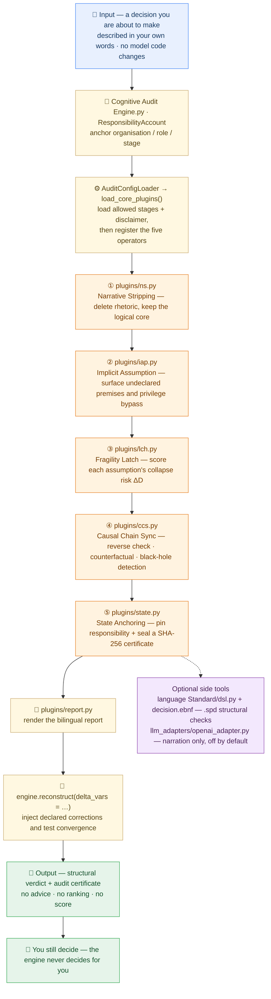

<p align="center">
  
  
  
  
</p>

<blockquote align="center">
  <em>Global Cognitive Audit Engine (GCAE) · Second-Perspective Language</em>
</blockquote>

<p align="center">
  <a href="README-zh.md">简体中文</a> | English
</p>

<div style="max-width:880px;margin:0 auto;padding:0 16px">

## ✦ About

<p style="font-size:15px;line-height:1.8;color:#2C2C2C">
<strong>Global Cognitive Audit Engine (GCAE)</strong> is the world's first neutral, core-offline, decision-agnostic cognitive-bias audit engine. It provides independent third-party security and compliance auditing for AI systems and enterprise decisions, without requiring modification of internal model code.
</p>

<p style="font-size:15px;line-height:1.8;color:#2C2C2C">
<strong>Core mission</strong> — all uncertainty, all disasters, all suffering ultimately stem from our ignorance of causal chains. The engine provides neutral, traceable structural support for high-stakes rational decisions by systematically identifying implicit assumptions, objective uncertainty, and human cognitive biases.
</p>

<p style="font-size:15px;line-height:1.8;color:#2C2C2C">
✅ <strong>Passed IMDA AI Verify assessment, total score 95</strong> — full report in <code>IMDA_AI_Verify_Causal_Audit_Report.pdf</code>.
</p>

</div>

## ✦ Citation

The method is specified in the public technical report (Version 1.0, 2026). Cite it as:

> Ji, Zhichen. *Structural Auditing of Decision Claims: A Deterministic Offline Method and Its Reproducible Evidence Chain.* Zenodo, 2026. DOI: [10.5281/zenodo.23244508](https://doi.org/10.5281/zenodo.23244508)

The deposit — report, Markdown source, verification log, and the complete source snapshot — is mirrored in [`docs/zenodo/deposit/`](./docs/zenodo/deposit/).

<p align="center">— ✦ —</p>

## ✦ Architecture

> **In one sentence:** GCAE is a **neutral auditor for decisions** — you describe a decision, and a chain of named modules takes it apart step by step, then hands you a structural verdict. It never decides for you.



**How to read it**

1. **Top to bottom is one audit run.** Your own description goes in; a structural verdict plus a certificate comes out — nothing else.
2. **Every step names the module that does it** (`plugins/ns.py` … `plugins/state.py`), so you can read the diagram and the source side by side. The five operators always run in this fixed order.
3. **The output is deliberately modest, and the side tools are optional.** No advice, no ranking, no score — and the DSL checker and the LLM narration adapter sit outside the main chain; the narration adapter is off by default and can never change a verdict.

📖 Every term explained in one plain sentence → [Glossary](./GLOSSARY.md)

## ✦ Live Demo

<div style="max-width:880px;margin:0 auto;padding:0 16px">

Experience the full five-operator causal audit pipeline directly in your browser — zero installation, zero upload, fully deterministic:

🌐 **Live demo**: [https://nohnlins.com/audit/](https://nohnlins.com/audit/)

> Runs entirely client-side. Your decision data never leaves the browser.

</div>

<p align="center">— ✦ —</p>

## ✦ Five Operators

<div style="max-width:880px;margin:0 auto;padding:0 16px">

Each operator ships as a plugin under `plugins/`:

| Operator | Plugin | Description |
|---|---|---|
| Narrative Stripping (NS) | `plugins/ns.py` | Strip rhetoric, emotion, and vague quantifiers; extract the logical core |
| Implicit Assumption Perspective (IAP) | `plugins/iap.py` | Reveal hidden assumptions, privilege bypass, and circular reasoning |
| Fragility Latch (LCH) | `plugins/lch.py` | Compute the ΔD collapse probability of each assumption; find the most fragile variable |
| Causal Chain Synchronization (CCS) | `plugins/ccs.py` | Reverse verification + counterfactual validation + black-hole detection |
| State Anchoring (STATE) | `plugins/state.py` | Responsibility anchoring + SHA-256 audit certificate |

</div>

<p align="center">— ✦ —</p>

## ✦ Invariant Formulas

<div style="max-width:880px;margin:0 auto;padding:0 16px">

<p style="font-size:15px;line-height:1.8;color:#2C2C2C">
<strong>p → Q</strong> — where <strong>p</strong> stands for principle, rule, or constraint, and <strong>Q</strong> stands for result, state, or consequence. The arrow denotes an inseparable, continuous, non-bypassable causal connection.
</p>

<p style="font-size:15px;line-height:1.8;color:#2C2C2C">
If the continuity between p and Q is severed, obscured, or quietly altered, the system is no longer under governance — it is under narrative.
</p>

<p style="font-size:15px;line-height:1.8;color:#2C2C2C">
<strong>Structural Audit Predicate</strong> — Φ{f_s, x, y} → {True, False}: based on the system function f_s and input conditions x, y, verify whether a given decision structure meets the minimum requirement of rational consistency. It produces only audit conclusions, not recommendations or optimizations.
</p>

<p style="font-size:15px;line-height:1.8;color:#2C2C2C">
<strong>Second-Perspective Decision Formula</strong> — a valid decision is a three-part structure: Decision (D) · Assumption Premise (A) · Branch Response (ΔD), i.e. <strong>¬A ⇒ ΔD</strong> (when the core assumption fails, the branch response triggers).
</p>

</div>

## ✦ Core Features

| Feature | Description |
|---|---|
| 🛡️ **Neutral Audit** | 100% neutral third-party stance, not bound to any LLM vendor |
| 🔒 **Core Offline** | Core audit is offline and deterministic; LLM enhancement is optional (off by default; enabling requires a domestic endpoint) |
| 🔐 **Privacy First** | Zero user data collection, local closed-loop data isolation |
| 🔍 **Bias Detection** | Identify hidden assumptions, uncertainty, and cognitive blind spots |
| 🔧 **No Model Modification** | Compatible with all mainstream LLMs; no source code changes required |
| 📊 **Structured Analysis** | Decision-structure verification only; no subjective conclusions |

<p align="center">— ✦ —</p>

## ✦ Quick Start

```bash
# Primary: GitHub
git clone https://github.com/nohn3043-arch/second-perspective.git
# Mirror: Gitee (this repository)
# git clone https://gitee.com/nohn-ecosystem/second-perspective.git
cd second-perspective
# Core is zero-dependency (Python 3.10+ stdlib only; no pip install needed)
# Optional: pip install -r requirements-openai.txt   # OpenAI narrative adapter

# 1) Five-operator end-to-end demo
python demo_audit.py

# 2) Independent verification suite (zero-dependency, 11 checks, CI-friendly exit code)
python verify.py
python verify.py --root    # print only the chain root, for cross-machine comparison

# 3) Self-verification & evaluation-design guide (verify the engine + design your own evaluation)
#    See TESTING.md — the single entry point (Chinese edition: TESTING-zh.md)
```

<p align="center">— ✦ —</p>

## ✦ Usage

<div style="max-width:880px;margin:0 auto;padding:0 16px">

The engine file uses space-separated naming by design — load it with `importlib`:

```python
import importlib.util

spec = importlib.util.spec_from_file_location("ca", "cognitive audit engine.py")
ca = importlib.util.module_from_spec(spec)
spec.loader.exec_module(ca)

account = ca.ResponsibilityAccount(
    organization="audit_team",
    role="third_party_auditor",
    stage="review",
)

config = ca.AuditConfigLoader.load_from_dict({
    "allowed_stages": ["pre_decision", "in_decision", "post_decision", "review"],
    "disclaimer": "Structural audit only — does not replace human judgment.",
    "custom_fields": {"standard_version": "2026"},
})

engine = ca.CognitiveAuditEngine(account=account, config=config)
engine.load_core_plugins()               # Register NS / IAP / LCH / CCS / STATE

report = engine.audit(decision_context)  # Static diagnosis

# Causal reconstruction: inject correction variables and test convergence
result = engine.reconstruct(decision_context, delta_vars={"assumption_x": False})
```

The five operators can also be imported directly as plugins:

```python
from plugins import (
    NarrativeStripPlugin,
    ImplicitAssumptionPlugin,
    FragilityLatchPlugin,
    CausalChainSyncPlugin,
    StateAnchorPlugin,
)
```

The optional narrative generation adapter is at [`llm_adapters/openai_adapter.py`](llm_adapters/openai_adapter.py).

</div>

<p align="center">— ✦ —</p>

## ✦ Project Structure

```
second-perspective/
├── Cognitive Audit Engine.py      # Core engine (space-separated naming by design)
├── demo_audit.py                  # Five-operator end-to-end demo
├── verify.py                      # Independent verification suite (11 checks, zero-dep)
├── TESTING.md                     # Self-verification & evaluation-design guide (single entry)
├── TESTING-zh.md                  # Chinese edition of the guide
├── plugins/                       # Five operators as plugins
│   ├── ns.py                      #   Narrative Stripping
│   ├── iap.py                     #   Implicit Assumption Perspective
│   ├── lch.py                     #   Fragility Latch
│   ├── ccs.py                     #   Causal Chain Synchronization
│   ├── state.py                   #   State Anchoring
│   └── report.py                  #   Bilingual report renderer
├── language Standard/             # Language Standard 2026
│   ├── 2026.md                    #   Normative standard (natural language)
│   ├── grammar.md                 #   Grammar specification (English)
│   ├── grammar-zh.md              #   Grammar specification (Chinese edition)
│   ├── decision.ebnf              #   Formal grammar (ISO/IEC 14977 EBNF)
│   ├── dsl.py                     #   Validator + generator, zero-dependency CLI
│   └── examples/                  #   .spd samples (valid / invalid / generated, EN + ZH)
├── 全新决策结构语言.md            # One-page decision-structure language overview
├── docs/COMPLIANCE_SHANGHAI.md    # Shanghai compliance note
├── llm_adapters/openai_adapter.py # Optional OpenAI narrative adapter
├── IMDA_AI_Verify_Causal_Audit_Report.pdf
├── requirements.txt · requirements-openai.txt
└── LICENSE
```

### Language toolchain

`language Standard/` ships the Decision Structure Language — a structural DSL that describes *the
boundary within which a decision holds*, and carries no execution semantics. Three layers, all
verified: **grammar** (`decision.ebnf`) → **validator** (`dsl.py check`) → **sample generator**
(`dsl.py gen`).

```bash
python "language Standard/dsl.py" check "language Standard/examples/valid_decision.spd"   # PASS, exit 0
python "language Standard/dsl.py" check "language Standard/examples/invalid_decision.spd" # FAIL, exit 1
python "language Standard/dsl.py" gen --seed 2026 --count 5 --out samples/ --self-check
python "language Standard/dsl.py" codes                                                    # 19 diagnostic codes
```

Zero external dependencies, stdlib only, deterministic (seeded). The validator ships a **bilingual
constraint lexicon** (English + Chinese) and exposes `--lang en|zh` on `gen`; the prose is English,
but Chinese `.spd` records are still fully checked. Per the standard's *Constraints*, the validator
**rejects** conclusions, recommendations, ranking/scoring and optimisation guidance; the generator
accordingly emits *form-valid samples only*, never advice.

<p align="center">— ✦ —</p>

## ✦ Ecosystem

GCAE is a member of the NOHN AI ecosystem — a family of projects built around second-perspective causal audit and deterministic execution:

| Project | Repository | Role |
|---|---|---|
| **Second-Perspective (GCAE)** | [nohn3043-arch/second-perspective](https://github.com/nohn3043-arch/second-perspective) | Global cognitive audit engine — five-operator causal audit core (IMDA 95/100) |
| **NOMOS** | [nohn3043-arch/second-perspective](https://github.com/nohn3043-arch/second-perspective) (`Intelligent-Decision-Hub--Nomos` branch) | Auditable deterministic decision hub (IMDA 95/100) |
| **SPL-G1** | [nohn3043-arch/SPL-G1](https://github.com/nohn3043-arch/SPL-G1) | Hardware causal-audit trusted compute unit (TCU) |
| **SPL-Virtual-World-Base** | [nohn3043-arch/Second-Reality](https://github.com/nohn3043-arch/Second-Reality) | Virtual-world and metaverse infrastructure (Constitution / Law / Bridge) |
| **Story-Engine** | [nohn3043-arch/story-engine](https://github.com/nohn3043-arch/story-engine) | Long-form narrative consistency engine |
| **Antares** | [nohn3043-arch/Antares](https://github.com/nohn3043-arch/Antares) | GFSIP v1.0 — federated stable interoperability protocol with causal audit |
| **Anthropomorphic-Agent-Engine** | [nohn3043-arch/Anthropomorphic-Agent-Engine](https://github.com/nohn3043-arch/Anthropomorphic-Agent-Engine) | Deterministic anthropomorphic psychology engine (SPL Pure Core V8.0) |
| **PAGES** | [nohn3043-arch/pages](https://github.com/nohn3043-arch/pages) | Official NOHN AI ecosystem landing page |

<p align="center">— ✦ —</p>

## ✦ License & Authorization

This repository is the technical showcase of the <strong>Global Cognitive Audit Engine (GCAE)</strong>. This repository is <strong>not open source</strong>. Dual-track model: free for personal non-commercial research; government / enterprise use requires a paid commercial license. See [LICENSE](./LICENSE) for details.

| User | Purpose | License Requirement |
|---|---|---|
| Individual (natural person) | Non-commercial academic research / study / personal experiments | **Free** under [LICENSE](./LICENSE) "Personal Free Research License" |
| Government agency / public institution / enterprise | Any purpose (including internal deployment, product development, service provision) | **Must sign a paid commercial license in advance** |

- **Individual researchers** may use it free for non-commercial research, but may not use it for any commercial purpose, nor provide services to any enterprise or government agency.
- **Government / enterprise users** may not copy, deploy, run, integrate, or distribute this work before signing a commercial license agreement and paying the agreed fee.
- **Apply for a license**: International / Global — [ai@nohnlins.com](mailto:ai@nohnlins.com) · China — [lin@secondai.top](mailto:lin@secondai.top)

The licensor, applicable law, and dispute resolution are determined by the user's location per [LICENSE](./LICENSE): users within China → Shanghai Linming Junhua Technology Co., Ltd. (PRC law); users outside China → NOHN AI TECHNOLOGY PTE. LTD. (Singapore law, SIAC arbitration).

- **Shanghai compliance note**: [COMPLIANCE_SHANGHAI](./docs/COMPLIANCE_SHANGHAI.md)
- **Data export**: LLM enhancement is off by default; enabling requires a domestic endpoint + input desensitization + user consent, and a data-export security assessment must be conducted as required by law when necessary.

### Clean-Room Declaration

Any party that independently develops a product substantially similar to the core functions, architecture, or decision model of this work shall be presumed to constitute substantial derivative infringement, unless it can provide complete, continuous, and traceable evidence of independent development.

**Disclaimer**: This language system is used only for structural review and decomposition in the decision process. It does not participate in decision-making, nor does it intervene in final decisions. The author assumes no legal or operational liability for any subsequent execution results.

<p align="center">
  <a href="https://github.com/nohn3043-arch">GitHub</a>
  &nbsp;·&nbsp;
  <a href="https://www.nohnlins.com/">nohnlins.com</a>
  &nbsp;·&nbsp;
  <a href="mailto:ai@nohnlins.com">ai@nohnlins.com</a>
</p>
<p align="center"><sub>NOHN AI · SECOND-PERSPECTIVE</sub></p>
